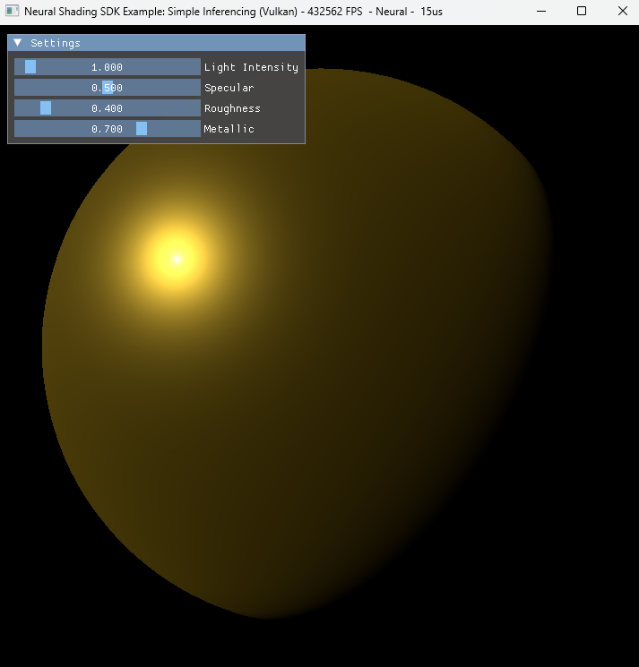
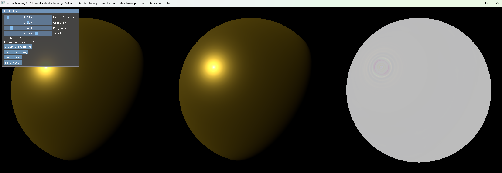
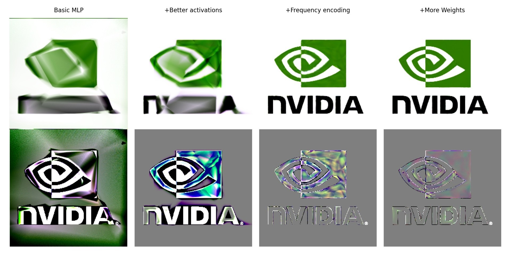

# Quick Start Guide

## Build steps

1. Clone the project recursively:
   
   ```
   git clone --recursive https://github.com/NVIDIA-RTX/RTXNS
   ```

2. Configure and then generate the solution using CMake GUI (or the CLI) by setting the repository root as _source_ and specifying a new _build_ directory in the root.
   
   ```
   cd Rtxns
   mkdir build
   cd build
   cmake ..
   ```

3. Open build/RtxNeuralShading.sln in Visual Studio and build all projects, or build using the CMake CLI
   
   ```
   cmake --build .
   ```

4. All of the binaries can be found in `\bin` such as
   
   ```
   bin\Debug\SimpleInferencing.exe
   ```

## About

All of the samples use the [Vulkan Cooperative Vector extension](https://registry.khronos.org/vulkan/specs/latest/man/html/VK_NV_cooperative_vector.html) and all the shaders are built using Slang.

### Samples

| Sample Name                                | Output                                                                   | Description                                                                                                                                                                                                                                                                                                                                                                                                                                                |
| ------------------------------------------ | ------------------------------------------------------------------------ | ---------------------------------------------------------------------------------------------------------------------------------------------------------------------------------------------------------------------------------------------------------------------------------------------------------------------------------------------------------------------------------------------------------------------------------------------------------- |
| [Simple Inferencing](SimpleInferencing.md) | [](simple_inferencing.png) | This sample demonstrates how to implement an inference shader using some of the low-level building blocks from RTXNS. The sample loads a trained network from a file and uses the network to approximate a Disney BRDF shader. The sample is interactive; the light source can be rotated and various material parameters can be modified at runtime.                                                                                                      |
| [Simple Training](SimpleTraining.md)       | [](simple_training.png)       | This sample builds on the Simple Inferencing sample to provide an introduction to training a neural network for use in a shader. The network replicates a transformed texture.                                                                                                                                                                                                                                                                             |
| [Shader Training](ShaderTraining.md)       | [](shader_training.png)       | This sample extends the techniques shown in the Simple Training example and introduces Slangs AutoDiff functionality, via a full MLP (Multi Layered Perceptron) abstraction. The MLP is implemented using the `CoopVector` training code previously introduced and provides a simple interface for training networks with Slang. The sample creates a network and trains a model on the Disney BRDF shader that was used in the Simple Inferencing sample. |
| [SlangPy Training](SlangpyTraining.md)     | [](slangpy_training.jpg)     | This sample shows how to create and train network architectures in python using SlangPy. This lets you experiment with different networks, encodings and more using the building blocks from RTXNS, but without needing to change or rebuild C++ code. As a demonstration this sample instantiates multiple different network architectures and trains them side-by-side on the same data. It also shows one possible approach of exporting the network parameters and architecture to disk so it can be loaded in C++. |

### Tutorial

* [Tutorial](Tutorial.md) 
  A tutorial to help guide you to create your own neural shader based on the [Shader Training](ShaderTraining.md) example.

### Library

* [Library](LibraryGuide.md) 
  A guide to using the library / helper functions to create and manage your neural networks.
  
  
  
  
  
  
