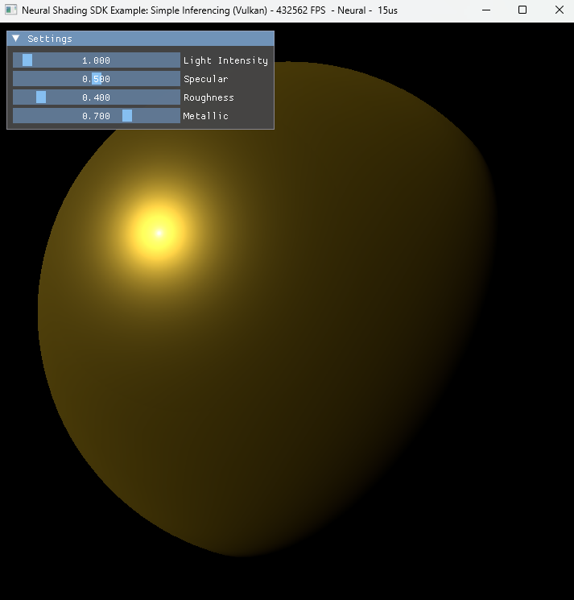
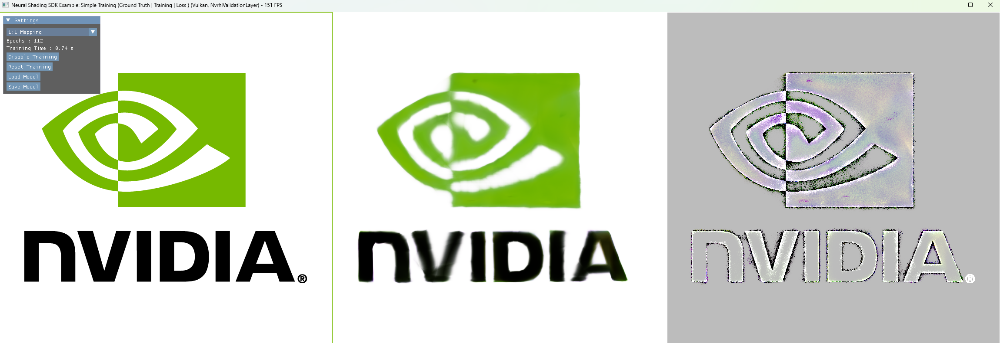
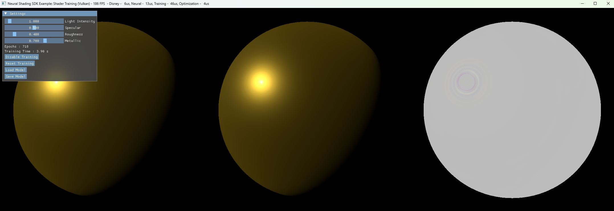
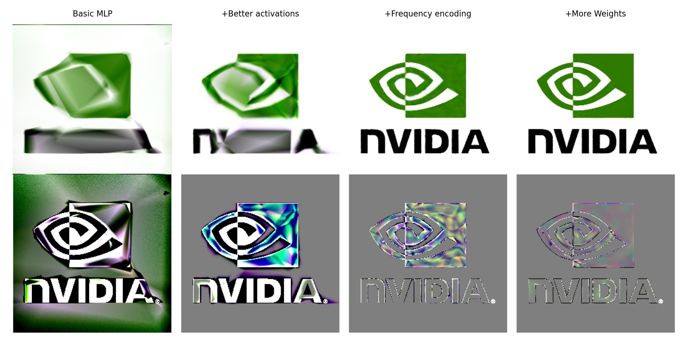
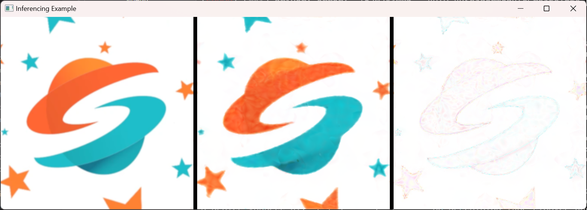

# RTX Neural Shading: Quick Start Guide

RTX Neural Shading can be built and run on Windows and Linux.

## Build steps

1. Clone the project recursively:
   
   ```
   git clone --recursive https://github.com/NVIDIA-RTX/RTXNS
   cd RTXNS
   ```

2. Configure and build using a preset (recommended):

   ```
   cmake --preset windows-x64-release
   cmake --build --preset windows-x64-release
   ```

   The available presets are:

   - `windows-x64-debug`
   - `windows-x64-release`
   - `windows-arm64-debug`
   - `windows-arm64-release`
   - `linux-debug`
   - `linux-release`

   Each preset uses Ninja and writes its build tree to `build/<preset>`. The Windows presets also enable the DX12 Cooperative Vector preview. Ninja is a requirement of the supplied presets, not of the SDK itself; custom CMake builds can use Visual Studio or another supported generator.

   On Windows, Visual Studio and VS Code can select these presets and configure the compiler environment automatically. From a command line, use the Visual Studio Developer Command Prompt for the target:

   - x64 on an x64 host: `vcvarsall x64`
   - Arm64 on an Arm64 host: `vcvarsall arm64`
   - Arm64 target on an x64 host: `vcvarsall x64_arm64`
   - x64 target on an Arm64 host: `vcvarsall arm64_x64`

   Build-time tools such as DXC, Slang, and ShaderMake are selected for the host architecture, so the Windows presets support native and cross builds from x64 and Arm64 hosts.

3. Alternatively, configure a custom build directory and generator. This preserves the SDK's existing generator-independent workflow:

   ```
   cmake -S . -B build -G Ninja -DCMAKE_BUILD_TYPE=Release
   cmake --build build
   ```

   To enable the DX12 Cooperative Vector preview in a custom Windows build, add `-DENABLE_DX12_COOP_VECTOR_PREVIEW=ON` when configuring.

   To generate a Visual Studio solution while retaining the architecture settings from a Windows preset, override the generator and use a separate build directory:

   ```
   cmake --preset windows-arm64-release -G "Visual Studio 17 2022" -B build/windows-arm64-vs
   cmake --build build/windows-arm64-vs --config Release
   ```

   Do not reuse a Ninja build directory for a Visual Studio build; a CMake build directory retains its original generator.

4. Find the sample executables and shaders under `bin/<platform>/<configuration>`, where `<platform>` is `windows-x64`, `windows-arm64`, `linux-x64`, or `linux-arm64`. The supplied presets use `Debug` or `Release`; custom builds may also use another CMake configuration, such as `RelWithDebInfo`. For example:
   
   ```
   bin/windows-arm64/Release/SimpleInferencing.exe
   ```

5. Select the graphics API when launching a sample with `-dx12` or `-vk`, where supported.

## About

All samples use Slang and can be compiled for DX12 or Vulkan using the DirectX Preview Agility SDK or Vulkan Cooperative Vector extension, respectively.

- [DirectX Preview Agility SDK](https://devblogs.microsoft.com/directx/directx12agility/).
- [Vulkan Cooperative Vector extension](https://registry.khronos.org/vulkan/specs/latest/man/html/VK_NV_cooperative_vector.html).

## Driver Requirements

- The DirectX configuration uses Agility SDK `1.721.3-preview` with Shader Model 6.10 and requires an [NVIDIA public R615 driver or newer](https://www.nvidia.com/en-us/drivers/).
- The Vulkan Cooperative Vector extension requires an [NVIDIA public R570 driver or newer](https://www.nvidia.com/en-us/drivers/).

### Samples

| Sample Name                                | Output                                                                   | Description                                                                                                                                                                                                                                                                                                                                                                                                                                                |
| ------------------------------------------ | ------------------------------------------------------------------------ | ---------------------------------------------------------------------------------------------------------------------------------------------------------------------------------------------------------------------------------------------------------------------------------------------------------------------------------------------------------------------------------------------------------------------------------------------------------- |
| [Simple Inferencing](SimpleInferencing.md) | [](simple_inferencing.png) | This sample demonstrates how to implement an inference shader using some of the low-level building blocks from RTXNS. The sample loads a trained network from a file and uses the network to approximate a Disney BRDF shader. The sample is interactive; the light source can be rotated and various material parameters can be modified at runtime.                                                                                                      |
| [Simple Training](SimpleTraining.md)       | [](simple_training.png)       | This sample builds on the Simple Inferencing sample to provide an introduction to training a neural network for use in a shader. The network replicates a transformed texture.                                                                                                                                                                                                                                                                             |
| [Shader Training](ShaderTraining.md)       | [](shader_training.png)       | This sample extends the techniques shown in the Simple Training example and introduces Slang's AutoDiff functionality through a full multilayer perceptron (MLP) abstraction. The MLP is implemented using the `CoopVec` training code previously introduced and provides a simple interface for training networks with Slang. The sample creates a network and trains a model on the Disney BRDF shader used in the Simple Inferencing sample. |
| [SlangPy Training](SlangpyTraining.md)     | [](slangpy_training.jpg)     | This sample shows how to create and train network architectures in Python using SlangPy. This lets you experiment with different networks, encodings, and more using the building blocks from RTXNS without needing to change or rebuild C++ code. As a demonstration, the sample instantiates multiple network architectures and trains them side by side on the same data. It also shows one approach to exporting the network parameters and architecture to disk so they can be loaded in C++. |
| [SlangPy Inferencing](SlangpyInferencing.md) | [](slangpy_inferencing_window.png) | This sample demonstrates how to run neural network inference in Python using the SlangPy library and then transition the same implementation to C++. The workflow illustrates a typical development pattern where initial prototyping and experimentation is done in Python using SlangPy for its flexibility and ease of use, and the same Slang code is later deployed in a C++ application for production use. The sample includes both Python and C++ implementations that perform the same neural network inference task, providing a clear path for transitioning between the two environments. |

### Tutorial

* [Tutorial](Tutorial.md) 
  A tutorial to help guide you to create your own neural shader based on the [Shader Training](ShaderTraining.md) example.

### Library

* [Library](LibraryGuide.md) 
  A guide to using the library / helper functions to create and manage your neural networks.
