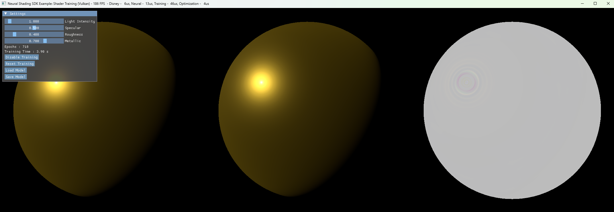

# RTX Neural Shading: Shader Training Example

## Purpose

This sample extends on the techniques shown in the [Simple Training](SimpleTraining.md) example and introduces Slangs AutoDiff functionality, via a full MLP (Multi Layered Perceptron) abstraction. The MLP is implemented using the `CoopVector` training code previously introduced and provides a simple interface for training networks with Slang. The sample creates a network and trains a model on the Disney BRDF shader that was used in the [Simple Inferencing](SimpleInferencing.md) sample. 



When the executable is built and run, the output shows 3 images where the image on the left is sphere lit with the full Disney BRDF shader. the middle image is the same sphere lit with the trained neural network and the final image on the right shows the loss delta. There is a UI which allows some control of the material properties as well as buttons to pause and reset the training as well as to save/load the current network.

## Training Flow

To create and train a neural network with RTXNS, several stages are needed which will be described in more detail below. This differs from the previous [Simple Training](SimpleTraining.md) example which had a specific compute shader pass for training and another for inference. In this example, the training and optimization passes are still compute based, but the inference is integrated into an existing pixel shader.

1. Create the host side neural network storage and initialize it

2. Create a device optimal layout and GPU buffer

3. Convert the host layout network to the device optimal layout on the GPU

4. Create auxiliary buffers for loss gradients and the optimizer pass

5. Run batches of the training shader followed by the optimizer shader on random inputs adjusting for the loss at each epoch

6. Render the sphere with the inference pixel shader to generate the output image

## Network Configuration

The network details can be found in [NetworkConfig.h](../samples/ShaderTraining/NetworkConfig.h) and are configured as follows :

| Property       | Value   | Notes                                       |
| -------------- | ------- | ------------------------------------------- |
| Input Features | 5       | 5 input parameters                          |
| Input Neurons  | 30      | 5 input parameters encoded to 6 inputs each |
| Output Neurons | 4       | 4 BRDF values                               |
| Hidden Neurons | 32      |                                             |
| Hidden Layers  | 3       |                                             |
| Precision      | float16 |                                             |

## Application Code

On the host, the setup of the neural network is quite simple and broadly similar to [Simple Training](SimpleTraining.md) so we shall only highlight the differences in this document.

### Training Loop

After creating the appropriate pipelines and allocating the GPU buffers, the training loop is similar to the Simple Training example. The training and optimization passes are executed multiple times per frame (`g_trainingStepsPerFrame = 100`) to speed up the training time whilst also running the inference pass at a reasonable rate to see the model convergence. 

```
for (int i = 0; i < g_trainingStepsPerFrame; ++i)
{
    nvrhi::ComputeState state;
    ...
    // Training pass
    state.bindings = { m_trainingPass.bindingSet };
    state.pipeline = m_trainingPass.pipeline;
    ...
    m_commandList->setComputeState(state);
    m_commandList->dispatch(m_batchSize / 64, 1, 1);
    ...
    // Optimizer pass
    state.bindings = { m_optimizerPass.bindingSet };
    state.pipeline = m_optimizerPass.pipeline;
    ...
    m_commandList->setComputeState(state);
    m_commandList->dispatch(div_ceil(m_totalParameterCount, 32), 1, 1);
    ...
}
```

Some of the timer related queries have been removed from the code for ease of understanding.

After the training pass, the 2 spheres are rendered as expected, but using 2 different pipelines: `m_directPass` for the native Disney BRDF shader and `m_inferencePass` for the trained neural model.

## Shader Code

The neural network in this sample is trying to encode the following :

```
Disney(NdotL, NdotV, NdotH, LdotH, roughness);
```

The shader code extends the concepts shown in the [Simple Training](SimpleTraining.md) example by using Slangs [AutoDiff](https://shader-slang.org/slang/user-guide/autodiff.html) feature to create a templated training class `TrainingMLP`, implemented in [MLP.slang](../src/NeuralShading_Shaders/MLP.slang), that can be used to help train your own models. Using the Autodiff features means we don't need to implement a full backwards pass containing all of the derivative activation functions as it is automatically derived for you.

The main 3 shaders are: [training](../samples/ShaderTraining/computeTraining.slang), [optimizer](../samples/ShaderTraining/computeOptimizer.slang) and [inference](../samples/ShaderTraining/renderInference.slang).

### Training

The training shader starts by generating the random inputs and encoding them ready for passing to the neural network.

```
//----------- Training step
float params[INPUT_FEATURES] = {NdotL, NdotV, NdotH, LdotH, roughness};
var inputParams = rtxns::EncodeFrequency<half, INPUT_FEATURES>(params);
```

Next, the model is created and the inputs are passed to the model for the forwards pass.

```
var model = rtxns::mlp::TrainingMLP<half, 
    NUM_HIDDEN_LAYERS, INPUT_NEURONS, HIDDEN_NEURONS, OUTPUT_NEURONS, 
    CoopVecMatrixLayout::TrainingOptimal, CoopVecComponentType::Float16>(
    gMLPParams, 
    gMLPParamsGradients, 
    rtxns::UnpackArray<NUM_TRANSITIONS_ALIGN4, NUM_TRANSITIONS>(gConst.weightOffsets),
    rtxns::UnpackArray<NUM_TRANSITIONS_ALIGN4, NUM_TRANSITIONS>(gConst.biasOffsets));
```

The `TrainingMLP` is heavily templated with lots of parameters, but the templated parameters consist of :

* Number of hidden layers
* Number of input neurons
* Number of neurons per hidden layer
* Number of output neurons
* Matrix layout
* Precision

The non templated parameters consist of :

* Weight/Bias buffer
* Gradient buffer
* Weight offsets per layer
* Bias offsets per layer

Once the model has been created, executing the forward pass is trivial and involves assigning templated activation functions to the forward pass before passing the input parameters in. The detailed implementation is described in the [Library Guide](LibraryGuide.md)

```
var hiddenActivation = rtxns::mlp::ReLUAct<half, HIDDEN_NEURONS>();
var finalActivation = rtxns::mlp::ExponentialAct<half, OUTPUT_NEURONS>();

var outputParams = model.forward(inputParams, hiddenActivation, finalActivation);
```

To generate the loss gradient, this example uses the `L2Relative` derivative function of the output of the actual disney BRDF shader and the output of the forward pass.

```
float4 predictedDisney = { outputParams[0], outputParams[1], outputParams[2], outputParams[3] };

float4 lossGradient = rtxns::mlp::L2Relative<float, 4>.deriv(actualDisney, predictedDisney, float4(LOSS_SCALE / (gConst.batchSize * 4)) * COMPONENT_WEIGHTS);
```

Finally, the loss gradient along with the input vector are passed through the models backward propagation function to update the gradient parameters.

```
model.backward(inputParams, hiddenActivation, finalActivation, rtxns::HCoopVec<OUTPUT_NEURONS>(lossGradient[0], lossGradient[1], lossGradient[2], lossGradient[3]));
```

### Optimizer

The optimizer shader is no different to the one used in the [Simple Training](SimpleTraining.md) example.

```
void adam_cs(uint3 dispatchThreadID: SV_DispatchThreadID)
{
    uint i = dispatchThreadID.x;
    if (i >= maxParamSize)
        return;

    float gradient = (float)gMLPParamsGradients[i];
    gMLPParamsGradients[i] = half(0.0);

    float weightbias = gMLPParams32[i];

    optimizers::Adam optimizer = optimizers::Adam(gMoments1, gMoments2, learningRate, LOSS_SCALE);

    float adjustedWeightbias = optimizer.step(weightbias, i, gradient, currentStep);

    gMLPParams32[i] = adjustedWeightbias;
    gMLPParams[i] = (half)adjustedWeightbias;
}
```

### Inference

The inference pass is nearly identical to the forward pass of the training shader. It currently uses `CoopVecMatrixLayout::TrainingOptimal` layout as it is run directly after a batch of training without converting the weights to an inference layout, but the default layout for inference should be `CoopVecMatrixLayout::InferencingOptimal`.

```
float4 DisneyMLP<let HIDDEN_LAYERS : int, let HIDDEN_NEURONS : int>(
    float NdotL, float NdotV, float NdotH, float LdotH, float roughness, ByteAddressBuffer mlpBuffer,
    uint weightOffsets[HIDDEN_LAYERS+1], uint biasOffsets[HIDDEN_LAYERS+1])
{
    // Calculate approximated core shader part using MLP
    float params[INPUT_FEATURES] = { NdotL, NdotV, NdotH, LdotH, roughness };

    var inputParams = rtxns::EncodeFrequency<half, INPUT_FEATURES>(params);

    var model = rtxns::mlp::InferenceMLP<half, 
        HIDDEN_LAYERS, 
        INPUT_FEATURES * FREQUENCY_EXPANSION, 
        HIDDEN_NEURONS, 
        OUTPUT_NEURONS, 
        CoopVecMatrixLayout::TrainingOptimal, 
        CoopVecComponentType::Float16>
        (mlpBuffer, weightOffsets, biasOffsets);

    var outputParams = model.forward(inputParams, rtxns::mlp::ReLUAct<half, HIDDEN_NEURONS>(), rtxns::mlp::ExponentialAct<half, OUTPUT_NEURONS>());
    return float4(outputParams[0], outputParams[1], outputParams[2], outputParams[3]);
}
```
