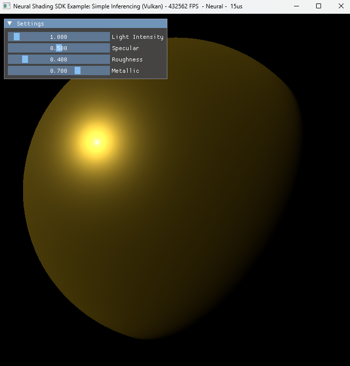

# Simple Inferencing Example

## Purpose

This sample demonstrates how to implement an inference shader using some of the low-level building blocks from RTXNS. The sample loads a trained network from a file and uses the network to approximate a Disney BRDF shader. The sample is interactive; the light source can be rotated and various material parameters can be modified at runtime.



When the executable is built and run, the output shows a lit sphere using the neural network to approximate a Disney BRDF shader.

## Inference Flow

To load an inference neural network with RTXNS, several stages are needed which will be described in more detail below.

1. Create the host side neural network storage and initialise it

2. Create a GPU copy of the storage and initialise it with the host copy

3. Run the normal render loop calling the inference code instead of the disney shader to shade the sphere.

## Application Code

On the host, the setup and running of the neural network is quite simple and uses our RTXNS abstractions that are layered ontop of the Graphics API Cooperative Vector extensions.

### Network Creation

A `rtxns::Network` is created and initialised from a file. To ensure platform portability, the network should be stored in a non GPU-optimised format, such as `rtxns::MatrixLayout::RowMajor` and then converted to a GPU optimised layout once loaded, as shown in the following code.

```
rtxns::Network net(GetDevice());
const std::filesystem::path dataPath = GetLocalPath("data");
if (!net.InitialiseFromFile(dataPath.string() + std::string("/disney.ns.bin")))
{
    log::debug("Loaded Neural Shading Network from file failed.");
    return false;
}
if (!net.ChangeLayout(rtxns::MatrixLayout::InferencingOptimal))
{
    log::debug("Converting network to inferencing failed.");
    return false;
}
```

This will load the network definition and parameters from the file, allocate a contiguous block of host memory for the parameters (weights and biases per layer), set the parameters from the file and finally convert the parameter layout to the GPU optimised `rtxns::MatrixLayout::InferencingOptimal` layout. Under the hood, this will use the `CoopVector` extensions to query the size of the allocations and perform the layout conversions.

### GPU Buffer Allocations

#### Float16 Parameter Buffer

The parameter buffer contains all of the weights and biases for the network stored at a suitable precision, such as float16. It will be used directly in the inferencing shaders as input to the Slang CoopVector functions so needs allocating on the GPU and copying over from the CPU.

There are hard GPU specific requirements on the alignment and size of each layer of weights and biases, but otherwise the layers can be packed as you like. In this sample, we copy all of the data into a contiguous block of GPU memory for simplicity.

```
nvrhi::BufferDesc paramsBufferDesc;
paramsBufferDesc.byteSize = params.size();
paramsBufferDesc.structStride = sizeof(float16_t);
paramsBufferDesc.debugName = "MLPParamsBuffer";
paramsBufferDesc.initialState = nvrhi::ResourceStates::CopyDest;
m_MLPParamsBuffer = GetDevice()->createBuffer(paramsBufferDesc);

...
m_commandList->writeBuffer(m_MLPParamsBuffer, params.data(), params.size());
```

### Render Loop

In this sample, the inference shader code is called directly from the pixel shader, so the render loop requires no modification apart from ensuring the parameter buffer is correctly bound.

## Shader Code

As previously stated, this sample is designed to use a neural network to approximate the Disney BRDF shader. For reference, the shader code calling the Disney shader might look like this :

```
void main_ps(float3 i_norm, float3 i_view, out float4 o_color : SV_Target0)
{
    //----------- Prepare input parameters
    float3 view = normalize(i_view);
    float3 norm = normalize(i_norm);
    float3 h = normalize(-lightDir.xyz + view);

    float NdotL = max(0.f, dot(norm, -lightDir.xyz));
    float NdotV = max(0.f, dot(norm, view));
    float NdotH = max(0.f, dot(norm, h));
    float LdotH = max(0.f, dot(h, -lightDir.xyz));

    //----------- Calculate core shader part DIRECTLY
    float4 outParams = DisneyBRDF(NdotL, NdotV, NdotH, LdotH, roughness);

    //----------- Calculate final color
    float3 Cdlin = float3(pow(baseColor[0], 2.2), pow(baseColor[1], 2.2), pow(baseColor[2], 2.2));
    float3 Cspec0 = lerp(specular * .08 * float3(1), Cdlin, metallic);
    float3 brdfn = outParams.x * Cdlin * (1-metallic) + outParams.y*lerp(Cspec0, float3(1), outParams.z) + outParams.w;
    float3 colorh = brdfn * float3(NdotL) * lightIntensity.rgb;

    o_color = float4(colorh, 1.f);
}
```

We aim to swap out the `DisneyBRDF()` function to replace it with the neural network variant `DisneyMLP`. The rest of the code should not change.

### Network Configuration

The size of the neural network can be discovered from the file it is loaded from, but for simplicity it is also hardcoded into [NetworkConfig.h](../samples/SimpleInferencing/NetworkConfig.h) which is shared by the application and shader code:

```
#define VECTOR_FORMAT half
#define TYPE_INTERPRETATION CoopVecComponentType::Float16

#define INPUT_FEATURES 5
#define INPUT_NEURONS (INPUT_FEATURES * 6) // Frequency encoding increases the input by 6 for each input 
#define OUTPUT_NEURONS 4
#define HIDDEN_NEURONS 32
```

This network therefore contains 30 input neurons (5 input features encoded into 6 input parameters per feature), generates 4 output neurons and there are 32 neurons in each hidden layer. Each neuron supports float16 precision.

### Input Parameters

The Disney BRDF model used in this example encodes the inputs into the 0-1 frequency domain which is preferred by neural networks. 

```
  float params[INPUT_FEATURES] = { NdotL, NdotV, NdotH, LdotH, roughness };
  inputParams = rtxns::EncodeFrequency<half, INPUT_FEATURES>(params);
```

### Inference Shader

The inference shader uses the native slang `CoopVec` class. This is used to map the neural network weights and biases to the hardware (tensor core) in a cooperative vector form. More detail on the `CoopVec` class can be found in our [Library Guide](LibraryGuide.md), but we shall perform a quick introduction here.

```
  CoopVec<VECTOR_FORMAT, INPUT_NEURONS> inputParams;
```

The above code declares a native CoopVec type of size `INPUT_NEURONS` using precision format `VECTOR_FORMAT`. We know from the previous `#defines` that in this sample, these map to :

```
  CoopVec<half, 30> inputParams;
```

There may be implementation specific size constraints on the underlying vector size (multiples of 32), but the Slang CoopVec objects can be created with arbitrary sizes and the compiler will pad as required. Conceptually, these CoopVec objects are equivalent to pytorch tensors and each layer in the neural network will take a cooperative vector as input and produce one as output. The input/output vectors may be different sizes. 

To execute the inference model, the `rtxns` functions are used with templated parameters to perform the forward propagation of the input cooperative vectors through the network.  For instance, the `LinearOp` function shown below will perform linear regression of the `INPUT_NEURONS` to the  `OUTPUT_NEURONS` using the precision format `VECTOR_FORMAT`. This is equivalent to `torch.nn.Linear` from pytorch.

```
hiddenParams = rtxns::LinearOp<VECTOR_FORMAT, HIDDEN_NEURONS, INPUT_NEURONS>(...)
```

The `LinearOp` function is a conveniance wrapper located in [LinearOps.slang](../src/NeuralShading_Shaders/LinearOps.slang), built upon the native `CoopVec` interface to performs a simple matrix multiply add. The underlying function is shown below:

```
coopVecMatMulAdd<Type, Size>(...)
```

Following the linear regression, an activation function is typically called. In this example. we use `relu`  from the `rtxns` namespace located in [CooperativeVectorFunctions.slang](../src/NeuralShading_Shaders/CooperativeVectorFunctions.slang).

```
hiddenParams = rtxns::relu(hiddenParams);
```

The linear regression and activation functions are called for each of the 4 layers of the network (1 input and 3 hidden). The final output is a `float4` containing the result of the Disney approximation to be used when calculating the final colour :

```
CoopVec<VECTOR_FORMAT, INPUT_NEURONS> inputParams;
CoopVec<VECTOR_FORMAT, HIDDEN_NEURONS> hiddenParams;
CoopVec<VECTOR_FORMAT, OUTPUT_NEURONS> outputParams;

// Encode input parameters, 5 inputs to 30 parameters 
float params[INPUT_FEATURES] = { NdotL, NdotV, NdotH, LdotH, roughness };
inputParams = rtxns::EncodeFrequency<half, INPUT_FEATURES>(params);

// Forward propagation through the neural network
// Input to hidden layer, then apply activation function
hiddenParams = rtxns::LinearOp<VECTOR_FORMAT, HIDDEN_NEURONS, INPUT_NEURONS>(
    inputParams, gMLPParams, weightOffsets[0], biasOffsets[0], CoopVecMatrixLayout::InferencingOptimal, TYPE_INTERPRETATION);
hiddenParams = rtxns::relu(hiddenParams);

// Hidden layer to hidden layer, then apply activation function 
hiddenParams = rtxns::LinearOp<VECTOR_FORMAT, HIDDEN_NEURONS, HIDDEN_NEURONS>(
    hiddenParams, gMLPParams, weightOffsets[1], biasOffsets[1], CoopVecMatrixLayout::InferencingOptimal, TYPE_INTERPRETATION);
hiddenParams = rtxns::relu(hiddenParams);

// Hidden layer to hidden layer, then apply activation function    
hiddenParams = rtxns::LinearOp<VECTOR_FORMAT, HIDDEN_NEURONS, HIDDEN_NEURONS>(
    hiddenParams, gMLPParams, weightOffsets[2], biasOffsets[2], CoopVecMatrixLayout::InferencingOptimal, TYPE_INTERPRETATION);
hiddenParams = rtxns::relu(hiddenParams);

// Hidden layer to output layer, then apply final activation function
outputParams = rtxns::LinearOp<VECTOR_FORMAT, OUTPUT_NEURONS, HIDDEN_NEURONS>(
    hiddenParams, gMLPParams, weightOffsets[3], biasOffsets[3], CoopVecMatrixLayout::InferencingOptimal, TYPE_INTERPRETATION);
outputParams = exp(outputParams);

// Take the output from the neural network as the output color
return float4(outputParams[0], outputParams[1], outputParams[2], outputParams[3]);
```

### Final Colour

Once the network has produced the 4 values, these are passed directly into the remainder of the shading code :

```
float3 Cdlin = float3(pow(baseColor[0], 2.2), pow(baseColor[1], 2.2), pow(baseColor[2], 2.2));
float3 Cspec0 = lerp(specular * .08 * float3(1), Cdlin, metallic);
float3 brdfn = outParams.x * Cdlin * (1-metallic) + outParams.y*lerp(Cspec0, float3(1), outParams.z) + outParams.w;
float3 colorh = brdfn * float3(NdotL) * lightIntensity.rgb;

o_color = float4(colorh, 1.f);

```

### Full Code

```
float4 DisneyMLP(float NdotL, float NdotV, float NdotH, float LdotH, float roughness)
{   
    uint4 weightOffsets = gConst.weightOffsets; 
    uint4 biasOffsets = gConst.biasOffsets;  

    CoopVec<VECTOR_FORMAT, INPUT_NEURONS> inputParams;
    CoopVec<VECTOR_FORMAT, HIDDEN_NEURONS> hiddenParams;
    CoopVec<VECTOR_FORMAT, OUTPUT_NEURONS> outputParams;

    // Encode input parameters, 5 inputs to 30 parameters 
    float params[INPUT_FEATURES] = { NdotL, NdotV, NdotH, LdotH, roughness };
    inputParams = rtxns::EncodeFrequency<half, INPUT_FEATURES>(params);

    // Forward propagation through the neural network
    // Input to hidden layer, then apply activation function
    hiddenParams = rtxns::LinearOp<VECTOR_FORMAT, HIDDEN_NEURONS, INPUT_NEURONS>(
        inputParams, gMLPParams, weightOffsets[0], biasOffsets[0], CoopVecMatrixLayout::InferencingOptimal, TYPE_INTERPRETATION);
    hiddenParams = rtxns::relu(hiddenParams);

    // Hidden layer to hidden layer, then apply activation function 
    hiddenParams = rtxns::LinearOp<VECTOR_FORMAT, HIDDEN_NEURONS, HIDDEN_NEURONS>(
        hiddenParams, gMLPParams, weightOffsets[1], biasOffsets[1], CoopVecMatrixLayout::InferencingOptimal, TYPE_INTERPRETATION);
    hiddenParams = rtxns::relu(hiddenParams);

    // Hidden layer to hidden layer, then apply activation function    
    hiddenParams = rtxns::LinearOp<VECTOR_FORMAT, HIDDEN_NEURONS, HIDDEN_NEURONS>(
        hiddenParams, gMLPParams, weightOffsets[2], biasOffsets[2], CoopVecMatrixLayout::InferencingOptimal, TYPE_INTERPRETATION);
    hiddenParams = rtxns::relu(hiddenParams);

    // Hidden layer to output layer, then apply final activation function
    outputParams = rtxns::LinearOp<VECTOR_FORMAT, OUTPUT_NEURONS, HIDDEN_NEURONS>(
        hiddenParams, gMLPParams, weightOffsets[3], biasOffsets[3], CoopVecMatrixLayout::InferencingOptimal, TYPE_INTERPRETATION);
    outputParams = exp(outputParams);

    // Take the output from the neural network as the output color
    return float4(outputParams[0], outputParams[1], outputParams[2], outputParams[3]);
}

[shader("fragment")]
void main_ps(float3 i_norm, float3 i_view, out float4 o_color: SV_Target0)
{
    float4 lightIntensity = gConst.lightIntensity;
    float4 lightDir =  gConst.lightDir;
    float4 baseColor = gConst.baseColor;
    float specular = gConst.specular;
    float roughness = gConst.roughness;
    float metallic = gConst.metallic;

    // Prepare input parameters
    float3 view = normalize(i_view);
    float3 norm = normalize(i_norm);
    float3 h = normalize(-lightDir.xyz + view);

    float NdotL = max(0.f, dot(norm, -lightDir.xyz));
    float NdotV = max(0.f, dot(norm, view));
    float NdotH = max(0.f, dot(norm, h));
    float LdotH = max(0.f, dot(h, -lightDir.xyz));

    // Calculate approximated core shader part using MLP
    float4 outParams = DisneyMLP(NdotL, NdotV, NdotH, LdotH, roughness);

    // Calculate final color
    float3 Cdlin = float3(pow(baseColor[0], 2.2), pow(baseColor[1], 2.2), pow(baseColor[2], 2.2));
    float3 Cspec0 = lerp(specular * .08 * float3(1), Cdlin, metallic);
    float3 brdfn = outParams.x * Cdlin * (1 - metallic) + outParams.y * lerp(Cspec0, float3(1), outParams.z) + outParams.w;
    float3 colorh = brdfn * float3(NdotL) * lightIntensity.rgb;

    o_color = float4(colorh, 1.f);
}
```

When compared with the original shader at the top of this section, it is clear that the only change is the original `DisneyBRDF()` function has been swapped out and replaced with the execution of the neural network in `DisneyMLP()`.
