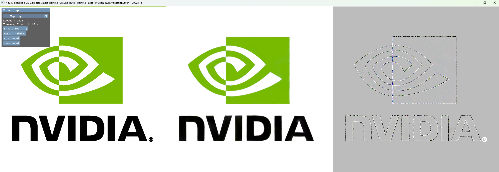

# RTX Neural Shading: Simple Training Example

## Purpose

This sample builds on the [Simple Inferencing](SimpleInferencing.md) sample to provide an introduction to training a neural network for use in a shader. The network replicates a transformed texture and should not be considered an example of texture compression but is designed for simplicity of understanding.


When the executable is built and run, the output shows the original texture on the left, the output of the neural network as it is trained in the middle and finally on the right it shows the (scaled) loss delta between the current trained image and the reference image to show progress. Once fully trained, the loss gradient image should be almost pure gray. A UI allows different transforms to be experimented with as well providing functionality to save and load the network.

## Training Flow

To create and train a neural network with RTXNS, several stages are needed which will be described in more detail below.

1. Create the host side neural network storage and initialize it

2. Create a device optimal layout and GPU buffer

3. Convert the host layout network to the device optimal layout on the GPU

4. Create auxiliary buffers for loss gradients and the optimizer pass

5. Run batches of the training shader followed by the optimizer shader

6. Run the inference shader to generate the output image

7. Optionally store the network to a file

## Network Configuration

The network details can be found in [NetworkConfig.h](../samples/SimpleTraining/NetworkConfig.h) and are configured as follows :

| Property       | Value   | Notes                              |
| -------------- | ------- | ---------------------------------- |
| Input Features | 2       | U, V Coordinates                   |
| Input Neurons  | 2 * 6   | Frequency Encoded U, V Coordinates |
| Output Neurons | 3       | R, G, B Values                     |
| Hidden Neurons | 64      |                                    |
| Hidden Layers  | 4       |                                    |
| Precision      | float16 |                                    |

After around 10-15s of training on an RTX 4090 GPU, this configuration has generated a reasonable approximation of the input texture:


## Application Code

On the host, the setup of the neural network is quite simple. A network architecture struct is populated from `NetworkConfig.h` and used to initialize the network. 

### Network Creation

This will allocate a contiguous block of host memory for the weights and biases that is correctly sized for the a host layout and the input network parameters and the data will be initialized from a normalized distribution. A device optimal layout for training is also created.

```
// Create Network
m_NeuralNetwork = std::make_unique<rtxns::Network>(GetDevice());
...
rtxns::NetworkArchitecture netArch = {};
netArch.inputNeurons = INPUT_NEURONS;
netArch.hiddenNeurons = HIDDEN_NEURONS;
netArch.outputNeurons = OUTPUT_NEURONS;
netArch.numHiddenLayers = NUM_HIDDEN_LAYERS;
netArch.biasPrecision = NETWORK_PRECISION;
netArch.weightPrecision = NETWORK_PRECISION;
...
m_NeuralNetwork->Initialise(netArch)
...
// Get a device optimized layout
m_deviceNetworkLayout = m_networkUtils->GetNewMatrixLayout(m_neuralNetwork->GetNetworkLayout(), rtxns::MatrixLayout::TrainingOptimal);

```

### GPU Buffer Allocations

Various GPU buffers are required for training and these need allocating based on the size of the network. The training itself will require float16 parameter buffers and an output gradient buffer which will be consumed in the Adam optimizer pass. The optimizer also uses a float32 version of the parameter buffer to retain precision and 2 identical buffers to store the pass `moments` data.

#### Float16 Parameter Buffer

The previous network creation code will allocate host-side memory for the parameters and populate it with default weights and biases. That is written to the GPU then converted to the device layout `rtxns::MatrixLayout::TrainingOptimal`, which will be used directly in the inferencing and training shaders as input to the CoopVector functions.

There are hard GPU specific requirements on the alignment and size of each layer of weights and biases, but otherwise the layers can be packed as you like. In this sample, we copy all of the data into a contiguous block of GPU memory for simplicity.

```
nvrhi::BufferDesc paramsBufferDesc;
paramsBufferDesc.byteSize = m_NeuralNetwork->GetNetworkParams().size();
...
m_mlpHostBuffer = GetDevice()->createBuffer(paramsBufferDesc);
...
m_CommandList->writeBuffer(m_mlpHostBuffer, m_NeuralNetwork->GetNetworkParams().data(), m_NeuralNetwork->GetNetworkParams().size());

paramsBufferDesc.byteSize = m_deviceNetworkLayout.networkSize;
...
m_mlpDeviceBuffer = GetDevice()->createBuffer(paramsBufferDesc);

// Convert to GPU optimized layout
m_networkUtils->ConvertWeights(m_neuralNetwork->GetNetworkLayout(), m_deviceNetworkLayout, m_mlpHostBuffer, 0, m_mlpDeviceBuffer, 0, GetDevice(), m_commandList);

```

#### Float32 Parameter Buffer

This sample uses float16 precision for the weights and biases. The reduced precision helps to improve the performance of the network but at the cost of accuracy. As such, there are several things that are required to ensure the loss of precision does not cause underflow/overflow issues in the gradient and loss calculations. We need to keep a float32 version of the parameter buffer on the GPU to ensure the loss adjustments in the optimizer are done in full 32-bit precision, before being copied back to the reduced 16-bit precision buffer for the training shaders. Therefore, a float32 GPU parameter buffer is also needed.

```
paramsBufferDesc.byteSize = m_TotalParamCount * sizeof(float); // convert to float
paramsBufferDesc.structStride = sizeof(float);
m_MLPParametersfBuffer = GetDevice()->createBuffer(paramsBufferDesc);
```

#### Gradient Buffer

After the back propagation phase of the training shader, the gradients for each neuron in the network should be stored for use in the optimizer pass. These gradients are stored in a float16 buffer the same size as the parameter buffers.

```
paramsBufferDesc.debugName = "MLPGradientsBuffer";
paramsBufferDesc.byteSize = m_TotalParamCount * sizeof(float16_t);
paramsBufferDesc.format = nvrhi::Format::R16_FLOAT;
m_MLPGradientsBuffer = GetDevice()->createBuffer(paramsBufferDesc);
```

#### Moments Buffers

The last important buffers to allocate are required for the Adam optimizer phase. These are float32 moment buffers which are again the same size as the parameter buffers.

```
paramsBufferDesc.debugName = "MLPMoments1Buffer";
paramsBufferDesc.initialState = nvrhi::ResourceStates::UnorderedAccess;
paramsBufferDesc.byteSize = m_TotalParamCount * sizeof(float);
paramsBufferDesc.format = nvrhi::Format::R32_FLOAT;
m_MLPMoments1Buffer = GetDevice()->createBuffer(paramsBufferDesc);
...
paramsBufferDesc.debugName = "MLPMoments2Buffer";
m_MLPMoments2Buffer = GetDevice()->createBuffer(paramsBufferDesc);
```

### Weight and Bias Offsets

After creating the buffers to be used in the shaders, we also need to extract the weights and bias offsets on the device layout into these buffers which are stored in the constant buffer. These are easily queried from the network layers.

```
NeuralConstants neuralConstants = {};

for (int i = 0; i < NUM_TRANSITIONS; ++i)
{
    neuralConstants.weightOffsets[i / 4][i % 4] = m_deviceNetworkLayout.networkLayers[i].weightOffset;
    neuralConstants.biasOffsets[i / 4][i % 4] = m_deviceNetworkLayout.networkLayers[i].biasOffset;
}
```

### Training Loop

After creating the appropriate pipelines, the training loop is reasonably simple and the training is done in batches :

| Property          | Value |
| ----------------- | ----- |
| BATCH_COUNT       | 128   |
| BATCH_SIZE_{X\|Y} | 32    |

The size of the batches should be tuned to your model.

```
for (uint32_t batch = 0; batch < BATCH_COUNT; batch++)
{
    // run the training pass
    state.bindings = { m_TrainingPass.m_BindingSet };
    state.pipeline = m_TrainingPass.m_Pipeline;
    m_CommandList->beginMarker("Training");
    m_CommandList->setComputeState(state);
    m_CommandList->dispatch(dm::div_ceil(BATCH_SIZE_X, 8), dm::div_ceil(BATCH_SIZE_Y, 8), 1);
    m_CommandList->endMarker();

    // optimizer pass
    state.bindings = { m_OptimizerPass.m_BindingSet };
    state.pipeline = m_OptimizerPass.m_Pipeline;
    m_CommandList->beginMarker("Update Weights");
    m_CommandList->setComputeState(state);
    m_CommandList->dispatch(dm::div_ceil(m_TotalParamCount, 32), 1, 1);
    m_CommandList->endMarker();

    neuralConstants.currentStep = ++m_AdamCurrentStep;
    m_CommandList->writeBuffer(m_NeuralConstantBuffer, &neuralConstants, sizeof(neuralConstants));
}
m_uiParams->epochs++;

...
// inference pass
state.bindings = { m_InferencePass.m_BindingSet };
state.pipeline = m_InferencePass.m_Pipeline;
m_CommandList->beginMarker("Inference");
m_CommandList->setComputeState(state);
m_CommandList->dispatch(dm::div_ceil(m_InferenceTexture->getDesc().width, 8), dm::div_ceil(m_InferenceTexture->getDesc().height, 8), 1);
m_CommandList->endMarker();
```

### Storing the Trained Network

When the `save` button is selected in the UI, the sample will store the trained data to a file by calling `rtxns::HostNetwork::UpdateFromBufferToFile()` with the float16 GPU parameter buffer.

```
 m_neuralNetwork->UpdateFromBufferToFile(
    m_mlpHostBuffer,
    m_mlpDeviceBuffer,
    m_neuralNetwork->GetNetworkLayout(),
    m_deviceNetworkLayout,
    m_uiParams->fileName,
    GetDevice(),
    m_commandList);
```

## Shader Code

The neural network in this sample is trying to encode a simple RGB lookup using UV coordinates as shown below :

```
float4 colour = inputTexture[uv].rgb;
```

Using pytorch, the network will look like the following:

```
nn.Linear(2, hidden_layer_size),  # UV as input
nn.LeakyReLU(),
nn.Linear(hidden_layer_size, hidden_layer_size),
nn.LeakyReLU(),
nn.Linear(hidden_layer_size, hidden_layer_size),
nn.LeakyReLU(),
nn.Linear(hidden_layer_size, hidden_layer_size),
nn.LeakyReLU(),
nn.Linear(hidden_layer_size, 3),  # RGB as output
nn.Sigmoid()  # Ensure output is between 0 and 1
```

The main 3 shaders are: [training](../samples/SimpleTraining/SimpleTraining_Training.slang), [optimizer](../samples/SimpleTraining/SimpleTraining_Optimizer.slang) and [inference](../samples/SimpleTraining/SimpleTraining_Inference.slang). 

### Training

The training runs in batches using randomly generated inputs which are passed forward through the network, compared with the ground truth and then the loss gradient is passed backwards through the network before the optimization pass updates the weights and biases.

The input data is frequency encoded to provide a richer input for the network. This isn't always necessary, but was found to give a 2x performance boost and a quality boost in this case. RTXNS provides some different options for encoding, but this sample uses `EncodeFrequency()`

```
// Get a random uv coordinate for the input and frequency encode it for improved convergance
float2 inputUV = clamp(float2(rng.next(), rng.next()), 0.0, 1.0);
CoopVec<VECTOR_FORMAT, INPUT_NEURONS> inputParams = rtxns::EncodeFrequency<half, 2>({inputUV.x, inputUV.y});
```

The forward pass is very similar to the [simple inferencing example](SimpleInferencing.md) pass, except the results from each layer need storing separately for re-use in the backwards pass.

```
// Create variables to cache the results from each stage
CoopVec<VECTOR_FORMAT, HIDDEN_NEURONS> hiddenParams[NUM_HIDDEN_LAYERS];
CoopVec<VECTOR_FORMAT, HIDDEN_NEURONS> hiddenActivated[NUM_HIDDEN_LAYERS];
CoopVec<VECTOR_FORMAT, OUTPUT_NEURONS> outputParams;
CoopVec<VECTOR_FORMAT, OUTPUT_NEURONS> outputActivated;

// Forward propagation through the neural network
// Input to hidden layer, then apply activation function
hiddenParams[0] = rtxns::LinearOp<VECTOR_FORMAT, HIDDEN_NEURONS, INPUT_NEURONS>(
    inputParams, gMLPParams, weightOffsets[0], biasOffsets[0], MATRIX_LAYOUT, TYPE_INTERPRETATION);
hiddenActivated[0] = rtxns::leakyReLU(hiddenParams[0], RELU_LEAK);

// Hidden layers to hidden layers, then apply activation function 
[ForceUnroll]
for (uint layer = 1; layer < NUM_HIDDEN_LAYERS; layer++)
{
    hiddenParams[layer] = rtxns::LinearOp<VECTOR_FORMAT, HIDDEN_NEURONS, HIDDEN_NEURONS>(
        hiddenActivated[layer - 1], gMLPParams, weightOffsets[layer], biasOffsets[layer], 
        MATRIX_LAYOUT, TYPE_INTERPRETATION);
    hiddenActivated[layer] = rtxns::leakyReLU(hiddenParams[layer], RELU_LEAK);
}

// Hidden layer to output layer, then apply final activation function    
outputParams = rtxns::LinearOp<VECTOR_FORMAT, OUTPUT_NEURONS, HIDDEN_NEURONS>(
    hiddenActivated[NUM_HIDDEN_LAYERS - 1], gMLPParams, weightOffsets[NUM_HIDDEN_LAYERS],
    biasOffsets[NUM_HIDDEN_LAYERS], MATRIX_LAYOUT, TYPE_INTERPRETATION);
outputActivated = rtxns::sigmoid(outputParams);
```

The result of the forward pass contains the predicted RGB from the network. This needs comparing against the ground truth to generate the loss gradient. The ground truth is dependent on the UI network transform selector:

```
// Take the output from the neural network as the output color
float3 predictedRGB = {outputActivated[0], outputActivated[1], outputActivated[2]};

// Now transform the input UVs according to the NetworkModel enum.
// This can easily be extended to try many different transforms.
uint2 actualUV;
if (gConst.networkTransform == NetworkTransform.Flip)
{
    float2 flipUV = inputUV.yx;
    actualUV = uint2(flipUV.xy * float2(gConst.imageHeight, gConst.imageWidth));
}
else if (gConst.networkTransform == NetworkTransform.Zoom)
{
    float2 zoomUV = inputUV * 0.5 + 0.25;
    actualUV = uint2(zoomUV.xy * float2(gConst.imageWidth, gConst.imageHeight));
}
else
{
    actualUV = uint2(inputUV.xy * float2(gConst.imageWidth, gConst.imageHeight));
}

// Load the texture according to the transformed input UVs. This will
// provide the RGB that the model is trying to train towards.
float3 actualRGB = inputTexture[actualUV].rgb;

// Output the loss, scaled to greyscale for output
uint2 lossUV = uint2(inputUV.xy * float2(gConst.imageWidth, gConst.imageHeight));
const float lossScaleFactor = 10.0f; // scale it up for better vis
lossTexture[lossUV] = float4((predictedRGB - actualRGB) * 0.5 * lossScaleFactor + 0.5, 1);

// Compute the L2 loss gradient
// L2Loss = (a-b)^2
// L2Loss Derivative = 2(a-b)
float3 lossGradient = 2.0 * (predictedRGB - actualRGB);
```

The loss gradient is vital to the successful training of this model, but as we are working in 16-bit precision it needs scaling to preserve as many bits of precision as possible. The scaling will be removed in the optimization step.

```
// Scale by batch size 
lossGradient /= (batchSize.x * batchSize.y);

// Apply the LOSS_SCALE factor to retain precision. Remove it in the optimizer pass before use.
lossGradient *= LOSS_SCALE;

CoopVec<VECTOR_FORMAT, OUTPUT_NEURONS> lossGradientCV = CoopVec<VECTOR_FORMAT, OUTPUT_NEURONS>(VECTOR_FORMAT(lossGradient[0]), VECTOR_FORMAT(lossGradient[1]), VECTOR_FORMAT(lossGradient[2]));
```

To compute the back propagation, we need to call derivative implementations of the activation functions and a backward version of the linear regression. These have been implemented in the `rtxns` namespace and can be easily extended. This will propagate the loss gradient back through the network. 

```
// Back-propogation pass, generate the gradients and accumulate the results into memory to be applied in the optimization pass.
CoopVec<VECTOR_FORMAT, OUTPUT_NEURONS> outputGradient;
CoopVec<VECTOR_FORMAT, HIDDEN_NEURONS> hiddenGradient;

// Output layer (loss gradient) to final hidden layer
outputGradient = rtxns::sigmoid_Backward(outputParams, lossGradientCV);
hiddenGradient = rtxns::LinearOp_Backward<VECTOR_FORMAT, OUTPUT_NEURONS, HIDDEN_NEURONS>(
   hiddenActivated[NUM_HIDDEN_LAYERS - 1], outputGradient, gMLPParams, gMLPParamsGradients, 
   weightOffsets[NUM_HIDDEN_LAYERS], biasOffsets[NUM_HIDDEN_LAYERS], MATRIX_LAYOUT, TYPE_INTERPRETATION);

// Hidden layer to hidden layer 
for(int layer = NUM_HIDDEN_LAYERS - 1; layer >= 1; layer--)
{
    hiddenGradient = rtxns::leakyReLU_Backward(hiddenParams[layer], RELU_LEAK, hiddenGradient);
    hiddenGradient = rtxns::LinearOp_Backward<VECTOR_FORMAT, HIDDEN_NEURONS, HIDDEN_NEURONS>
        (hiddenActivated[layer - 1], hiddenGradient, gMLPParams, gMLPParamsGradients, 
        weightOffsets[layer], biasOffsets[layer], MATRIX_LAYOUT, TYPE_INTERPRETATION);
}

// First hidden layer to input layer
hiddenGradient = rtxns::leakyReLU_Backward(hiddenParams[0], RELU_LEAK, hiddenGradient);
rtxns::LinearOp_Backward<VECTOR_FORMAT, HIDDEN_NEURONS, INPUT_NEURONS>(
    inputParams, hiddenGradient, gMLPParams, gMLPParamsGradients, weightOffsets[0], 
    biasOffsets[0], MATRIX_LAYOUT, TYPE_INTERPRETATION);
```

The output of the back propagation pass will be updated gradients per weight stored in `gMLPParamsGradients`.

### Optimizer

As seen in the training loop, the optimizer is executed after a single training batch. The purpose of the optimizer is to perform the gradient descent to find the minima of the training model, which in real terms means it adjusts each neurons weight (and bias) in the model by a small amount of its gradient (`gMLPParamsGradients`) to try and find the best value for that neuron. In this example, we have implemented the [Adam](https://arxiv.org/pdf/1412.6980) optimizer.

```
void adam_cs(uint3 dispatchThreadID: SV_DispatchThreadID)
{
    uint i = dispatchThreadID.x;
    if (i >= maxParamSize)
        return;

    float gradient = (float)gMLPParamsGradients[i];
    gMLPParamsGradients[i] = half(0.0);

    // Get the floating point params, not float16
    float weightbias = gMLPParamsf[i];

    optimizers::Adam optimizer = optimizers::Adam(gMoments1, gMoments2, learningRate, LOSS_SCALE);

    float adjustedWeightbias = optimizer.step(weightbias, i, gradient, currentStep);

    gMLPParamsf[i] = adjustedWeightbias;
    gMLPParams[i] = (half)adjustedWeightbias;
}
```

The shader code is reasonably simple. The compute shader walks over each parameter in the buffer (which could be a weight or a bias) and calls the optimizer to adjust it. It uses the full 32-bit precision floating point version of the parameter buffer for the gradient descent and once adjusted, stores the value in both the 32-bit precision and 16-bit precision buffers. As previously mentioned, the `LOSS_SCALE` factor used in the training is supplied to the optimizer to restore the precision as needed. The gradients are convert to 32-bit precision floating point and reset at the same time. The reset is important for the next training batch.

The adam optimizer could be replaced if needed by adding a new algorithm to the Optimizers module.

### Inference

The inference pass is nearly identical to the forward pass of the training. It currently uses `CoopVecMatrixLayout::TrainingOptimal` layout as it is run directly after a batch of training, but if the sample was changed to only execute the inference pass (which would be the default usage), then the layout would be `CoopVecMatrixLayout::InferencingOptimal`. 

The other change is that we no longer need to cache the parameters returned by each linear regression or activation function as we did in the forwards pass of the training shader. Finally, the input vectors come from the compute shader threadIDs, rather than randomly generated.

```
// Set the input ID as the uv coordinate and frequency encode it for the network
float2 inputUV = float2(dispatchThreadID.x / float(gConst.imageWidth), dispatchThreadID.y / float(gConst.imageHeight));
CoopVec<VECTOR_FORMAT, INPUT_NEURONS> inputParams = rtxns::EncodeFrequency<half, 2>({inputUV.x, inputUV.y});

// Load offsets
uint weightOffsets[NUM_TRANSITIONS] = rtxns::UnpackArray<NUM_TRANSITIONS_ALIGN4, NUM_TRANSITIONS>(gConst.weightOffsets);
uint biasOffsets[NUM_TRANSITIONS] = rtxns::UnpackArray<NUM_TRANSITIONS_ALIGN4, NUM_TRANSITIONS>(gConst.biasOffsets);

CoopVec<VECTOR_FORMAT, HIDDEN_NEURONS> hiddenParams;
CoopVec<VECTOR_FORMAT, OUTPUT_NEURONS> outputParams;

// Forward propagation through the neural network
// Input to hidden layer, then apply activation function
hiddenParams = rtxns::LinearOp<VECTOR_FORMAT, HIDDEN_NEURONS, INPUT_NEURONS>(inputParams, gMLPParams, weightOffsets[0], biasOffsets[0], MATRIX_LAYOUT, TYPE_INTERPRETATION);
hiddenParams = rtxns::leakyReLU(hiddenParams, RELU_LEAK);

// Hidden layers to hidden layers, then apply activation function 
[ForceUnroll]
for (uint layer = 1; layer < NUM_HIDDEN_LAYERS; layer++)
{
    hiddenParams = rtxns::LinearOp<VECTOR_FORMAT, HIDDEN_NEURONS, HIDDEN_NEURONS>(hiddenParams, gMLPParams, weightOffsets[layer], biasOffsets[layer], MATRIX_LAYOUT, TYPE_INTERPRETATION);
    hiddenParams = rtxns::leakyReLU(hiddenParams, RELU_LEAK);
}

// Hidden layer to output layer, then apply final activation function
outputParams = rtxns::LinearOp<VECTOR_FORMAT, OUTPUT_NEURONS, HIDDEN_NEURONS>(hiddenParams, gMLPParams, weightOffsets[NUM_HIDDEN_LAYERS], biasOffsets[NUM_HIDDEN_LAYERS], MATRIX_LAYOUT, TYPE_INTERPRETATION);
outputParams = rtxns::sigmoid(outputParams);

// Take the output from the neural network as the output color
float4 color = {outputParams[0], outputParams[1], outputParams[2], 1.f};
outputTexture[dispatchThreadID.xy] = color;
```
