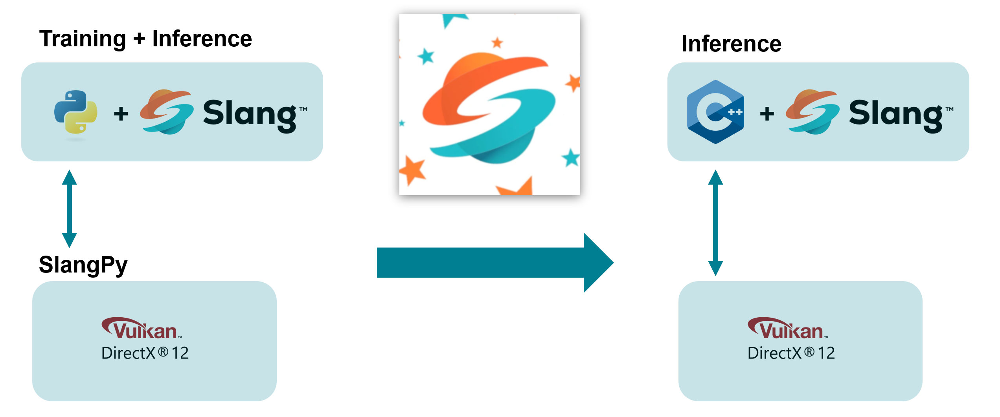
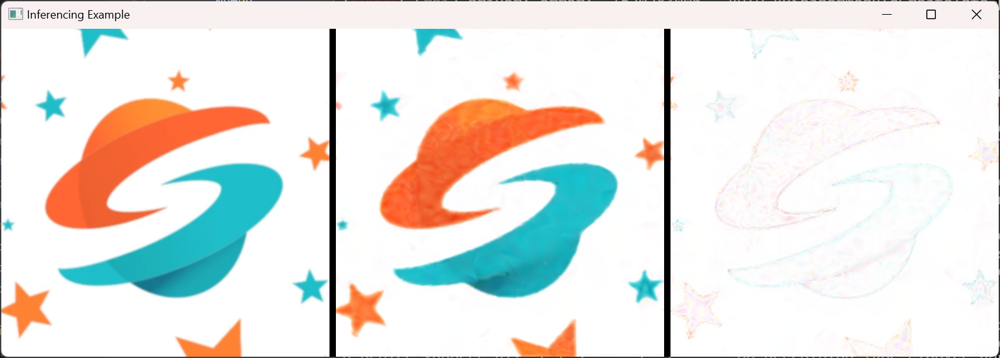
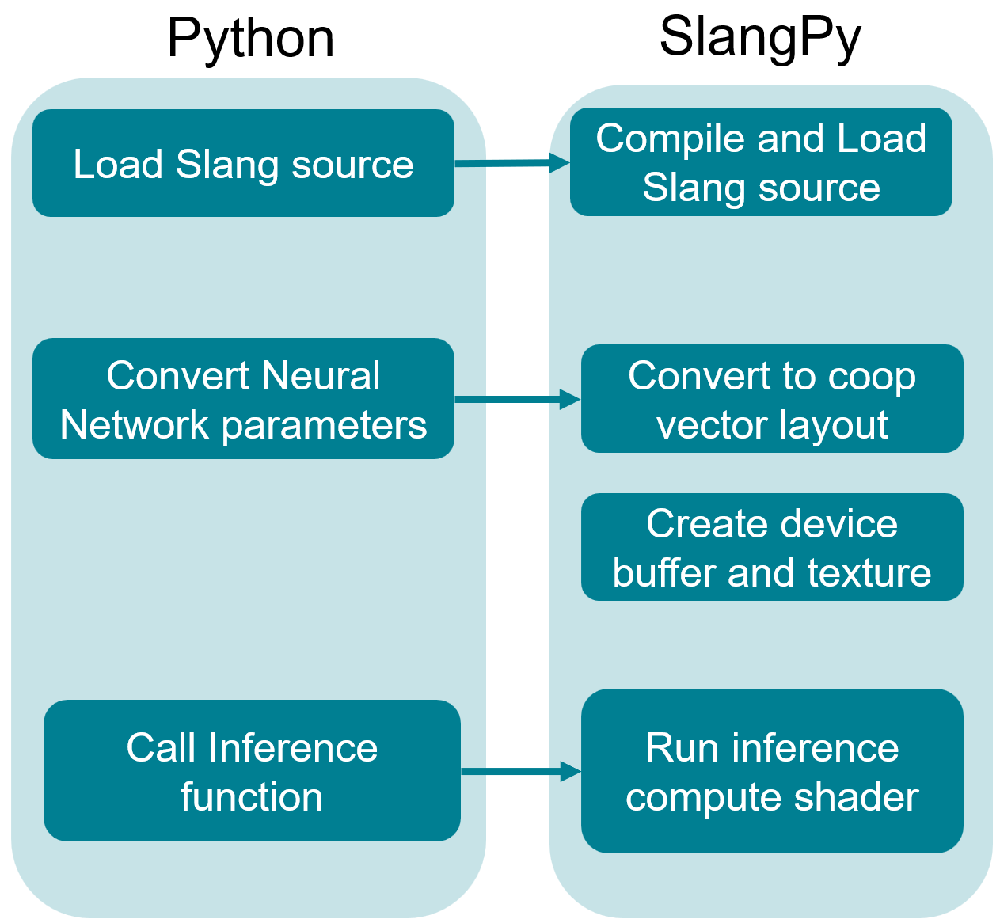
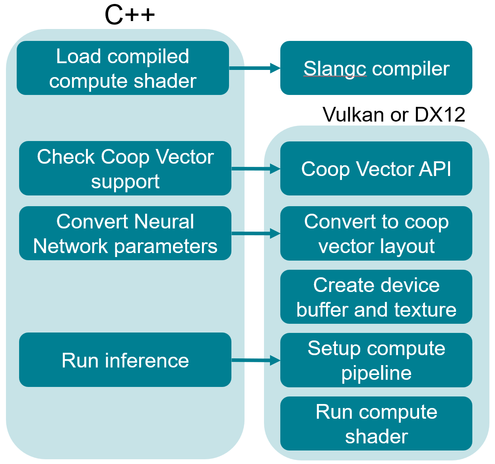
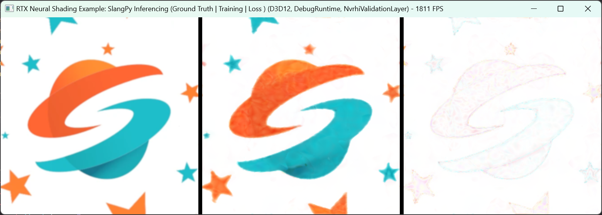

# RTX Neural Shading: SlangPy Inferencing Example

## Purpose

This sample demonstrates how to run neural network inference in Python using the SlangPy library, and then transition the same implementation to C++. The workflow illustrates a typical development pattern:

1. **Prototyping**: Start in Python with SlangPy for flexibility and rapid iteration.
2. **Deployment**: Move the same Slang code to a C++ application for production use.

By maintaining consistent Slang source code between both implementations, you can leverage Python's rapid development while achieving C++ performance in your final application. This approach minimizes code duplication and ensures consistent behavior across language boundaries.

The sample includes both Python and C++ implementations that perform the same neural network inference task, providing a clear path for transitioning between the two environments.



## Motivation

Starting with SlangPy and Python's flexibility makes it easier to experiment with neural network configurations. Slang's autodiff functionality helps implement training code efficiently.

Once satisfied with the results, you can deploy your trained neural implementation to a C++ graphics engine. This sample shows how to make that transition with minimal changes to your Slang neural network implementation.

**Key advantages of this workflow:**

1. **Rapid Prototyping**: Python's dynamic nature and ecosystem enable quick experimentation.
2. **Seamless Transition**: Use the same Slang code in both environments to avoid rewriting logic.
3. **Performance Optimization**: C++ provides the performance needed for real-time applications.
4. **Unified Codebase**: Maintain a single source of truth for your neural network logic.
5. **Debugging Efficiency**: Identify and fix problems in Python before deploying to C++.

This approach is valuable for graphics and ML engineers balancing experimentation speed with runtime performance.

### Python Requirements

- Python 3.9 or newer
- Required Python packages (installed via `requirements.txt`):
    - SlangPy
    - NumPy

### Installing Required Python Modules

In the root folder, run:
```sh
pip install -r samples/SlangpyInferencing/requirements.txt
```

### Running the SlangPy Sample

In the root folder, run:
```sh
python samples\SlangpyInferencing\SlangpyInferencing.py
```
This launches the SlangPy sample, showing the original picture, inferred picture, and amplified error image.



## SlangPy Inferencing Overview

The Python sample uses the SlangPy library to call GPU code written in Slang from Python. For more details, see the [official documentation](https://SlangPy.readthedocs.io/en/latest/). Below is a brief overview.



### Architecture Overview

#### Device Setup and Loading Slang Source Code

Create a window with an attached `Device` object using the `App` class from `app.py`:
```python
app = App(width=512*3+10*2, height=512, title="Mipmap Example", device_type=spy.DeviceType.vulkan)
```

Load a Slang module:
```python
module = spy.Module.load_from_file(app.device, "SlangpyInferencing_pyslang.slang")
```

#### Neural Network Data Structures

In Python, the neural network is represented by the `Network` structure:

```python
class Network(spy.InstanceList):
    def __init__(self, data: dict):
        super().__init__(module["Network"])
        assert len(data['layers']) == 3
        self.layer0 = NetworkParameters(data['layers'][0])
        self.layer1 = NetworkParameters(data['layers'][1])
        self.layer2 = NetworkParameters(data['layers'][2])
```

On the Slang side:
```c++
struct Network {
    NetworkParameters<16, 32>  layer0;
    NetworkParameters<32, 32>  layer1;
    NetworkParameters<32, 3>   layer2;

    float3 eval(no_diff float2 uv)
```

The Python `NetworkParameters` class converts weights and biases to a cooperative vector layer. The Slang source implements a `forward` method for a single layer:

```c++
struct NetworkParameters<int Inputs, int Outputs>
{
    static const CoopVecComponentType ComponentType = CoopVecComponentType.Float16;
    ByteAddressBuffer weights, biases;

    CoopVec<half, Outputs> forward(CoopVec<half, Inputs> x)
    {
        return coopVecMatMulAdd<half, Outputs>(
            x, ComponentType,
            weights, 0, ComponentType,
            biases, 0, ComponentType,
            CoopVecMatrixLayout.InferencingOptimal, 
            false, 
            0
        );
    }
}
```

#### Inference

Load weights and biases from a JSON file and create a `Network` instance:
```python
trained_weights = json.load(open(AssetsPath / 'weights.json'))
network = Network(trained_weights)
```

In the main loop, display the original picture, call inference and loss functions from Slang, and blit result images:

```python
while app.process_events():
    offset = 0
    app.blit(image, size=spy.int2(512), offset=spy.int2(offset,0), bilinear=True, tonemap=False)
    offset += 512 + 10
    res = spy.int2(256,256)

    lr_output = spy.Tensor.empty_like(image)
    module.inference(pixel = spy.call_id(), resolution = res, network = network, _result = lr_output)
    app.blit(lr_output, size=spy.int2(512, 512), offset=spy.int2(offset, 0), bilinear=True, tonemap=False)
    offset += 512 + 10

    loss_output = spy.Tensor.empty_like(image)
    module.loss(pixel = spy.call_id(),
                resolution = res,
                network = network,
                reference = image,
                _result = loss_output)
    app.blit(loss_output, size=spy.int2(512, 512), offset=spy.int2(offset, 0), tonemap=False)
    offset += 512 + 10

    app.present()
```

## C++ Inferencing Overview

The C++ implementation is designed for optimal performance in production. While SlangPy is excellent for prototyping, C++ provides the performance needed for real-time applications.

The C++ version uses the `donut` graphics engine and reuses the same Slang source code as the Python version.



### Adding Slang to the Build System

In Python, SlangPy loads and compiles Slang code. In C++, use the `slangc` compiler to produce binaries for DX12 and Vulkan.

Integrate Slang compilation into your build system:

```cmake
include(../../external/donut/compileshaders.cmake)

set(SHADER_COMPILE_OPTIONS "--matrixRowMajor --hlsl2021" )
set(SHADER_COMPILE_OPTIONS_SPIRV " -X \"-Wno-41017 -capability spvCooperativeVectorNV -capability spvCooperativeVectorTrainingNV\" " )
set(SHADER_COMPILE_OPTIONS_DXIL " --shaderModel 6_9 --hlsl2021 -X \"-Wno-41012 -Wno-41016 -Wno-41017 -Xdxc -Vd\" " )

file(GLOB_RECURSE ${project}_shaders "*.hlsl" "*.hlsli" "*.slang")

donut_compile_shaders_all_platforms(
    TARGET ${project}_shaders
    CONFIG ${CMAKE_CURRENT_SOURCE_DIR}/shaders.cfg
    INCLUDES ${shader_includes}
    FOLDER ${folder}
    OUTPUT_BASE ${RTXNS_BINARY_DIR}/shaders/${project}
    SHADERMAKE_OPTIONS ${SHADER_COMPILE_OPTIONS}
    SHADERMAKE_OPTIONS_SPIRV ${SHADER_COMPILE_OPTIONS_SPIRV}
    SHADERMAKE_OPTIONS_DXIL ${SHADER_COMPILE_OPTIONS_DXIL}
    SOURCES ${${project}_shaders}
    SLANG
)
```

Define entry points for Slang shaders in `shaders.cfg`:
```
SlangpyInferencing_cpp.slang -E inference_cs -T cs
```

### Initializing Cooperative Vector Support

To use cooperative vector operations, you must enable the appropriate features for your graphics API:

#### DirectX 12

Enable experimental shader models and cooperative vector support:

```c++
UUID features[] = { D3D12ExperimentalShaderModels, D3D12CooperativeVectorExperiment };
HRESULT hr = D3D12EnableExperimentalFeatures(_countof(features), features, nullptr, nullptr);
```

#### Vulkan

Require the cooperative vector extension during device initialization:

```c++
deviceParams.requiredVulkanDeviceExtensions.push_back(VK_NV_COOPERATIVE_VECTOR_EXTENSION_NAME);
```

### Neural Network Parameters Loading

Load neural network parameters from the same JSON file as the Python version:

```c++
m_networkUtils = std::make_shared<rtxns::NetworkUtilities>(GetDevice());
m_neuralNetwork = std::make_unique<rtxns::HostNetwork>(m_networkUtils);

if (!m_neuralNetwork->InitialiseFromJson(*nativeFS, (dataPath / "weights.json").string()))
{
    log::error("Failed to create a network.");
    return false;
}

assert(m_neuralNetwork->GetNetworkLayout().networkLayers.size() == 3);

m_deviceNetworkLayout = m_networkUtils->GetNewMatrixLayout(m_neuralNetwork->GetNetworkLayout(), rtxns::MatrixLayout::InferencingOptimal);
```

### GPU Buffers Allocation and Parameters Conversion

Create buffers for the original and cooperative vector layouts:

```c++
const auto& params = m_neuralNetwork->GetNetworkParams();

nvrhi::BufferDesc paramsBufferDesc;
paramsBufferDesc.byteSize = params.size();
paramsBufferDesc.debugName = "MLPParamsHostBuffer";
paramsBufferDesc.canHaveUAVs = true;
paramsBufferDesc.initialState = nvrhi::ResourceStates::CopyDest;
paramsBufferDesc.keepInitialState = true;
m_mlpHostBuffer = GetDevice()->createBuffer(paramsBufferDesc);

paramsBufferDesc.structStride = sizeof(uint16_t);
paramsBufferDesc.byteSize = m_deviceNetworkLayout.networkSize;
paramsBufferDesc.canHaveRawViews = true;
paramsBufferDesc.canHaveUAVs = true;
paramsBufferDesc.canHaveTypedViews = true;
paramsBufferDesc.format = nvrhi::Format::R16_FLOAT;
paramsBufferDesc.debugName = "MLPParamsByteAddressBuffer";
paramsBufferDesc.initialState = nvrhi::ResourceStates::UnorderedAccess;
m_mlpDeviceBuffer = GetDevice()->createBuffer(paramsBufferDesc);
```

Upload parameters and convert to the GPU-optimized layout:

```c++
// Upload the host side parameters
m_commandList->setBufferState(m_mlpHostBuffer, nvrhi::ResourceStates::CopyDest);
m_commandList->commitBarriers();
m_commandList->writeBuffer(m_mlpHostBuffer, m_neuralNetwork->GetNetworkParams().data(), m_neuralNetwork->GetNetworkParams().size());

// Convert to GPU optimized layout
m_networkUtils->ConvertWeights(m_neuralNetwork->GetNetworkLayout(), 
        m_deviceNetworkLayout, m_mlpHostBuffer, 0, m_mlpDeviceBuffer, 0, GetDevice(), m_commandList);

// Update barriers for use
m_commandList->setBufferState(m_mlpDeviceBuffer, nvrhi::ResourceStates::ShaderResource);
m_commandList->commitBarriers();
```

### Compute Shader

In Python, SlangPy handles compute shader and bindings. In C++, manually implement the compute shader to call `inference` and `loss`:

```c++
DECLARE_CBUFFER(NeuralConstants, gConst, 0, 0);
RWTexture2D<float4> inferenceTexture : REGISTER_UAV(0, 0);
RWTexture2D<float4> lossTexture : REGISTER_UAV(1, 0);

Texture2D<float4> inputTexture : REGISTER_SRV(0, 0);

Network network;

[shader("compute")]
[numthreads(8, 8, 1)]
void inference_cs(uint3 pixel: SV_DispatchThreadID)
{
    inferenceTexture[pixel.xy].rgb = inference(pixel.xy, gConst.resolution, network);
    lossTexture[pixel.xy].rgb = loss(pixel.xy, gConst.resolution, inputTexture[pixel.xy].rgb, network);
}
```

Add bindings to the `Network` structure:

```c++
struct NetworkParameters<int Inputs, int Outputs, int WeightReg, int BiasReg>
{
    static const CoopVecComponentType ComponentType = CoopVecComponentType.Float16;

    ByteAddressBuffer weights : REGISTER_SRV(WeightReg, 0);
    ByteAddressBuffer biases : REGISTER_SRV(BiasReg, 0);

    CoopVec<half, Outputs> forward(CoopVec<half, Inputs> x)
    {
        return coopVecMatMulAdd<half, Outputs>(
            x, ComponentType,
            weights, 0, ComponentType,
            biases, 0, ComponentType,
            CoopVecMatrixLayout.InferencingOptimal, false, 0
        );
    }
}

struct Network {
    NetworkParameters<16, 32, 0, 1> layer0;
    NetworkParameters<32, 32, 2, 3> layer1;
    NetworkParameters<32, 3, 4, 5>  layer2;
```

On the C++ side, all neural network parameters are stored in a single buffer. Bind different ranges of the buffer to the Slang side:

```c++
nvrhi::BindingSetDesc bindingSetDesc;
bindingSetDesc.bindings = {
    nvrhi::BindingSetItem::ConstantBuffer(0, m_NeuralConstantBuffer),
    nvrhi::BindingSetItem::Texture_UAV(0, m_InferenceTexture),
    nvrhi::BindingSetItem::Texture_UAV(1, m_LossTexture),
    nvrhi::BindingSetItem::Texture_SRV(0, m_InputTexture),
};
{
    int i = 1;
    for (const auto& l : m_deviceNetworkLayout.networkLayers)
    {
        bindingSetDesc.bindings.push_back(nvrhi::BindingSetItem::RawBuffer_SRV(i++, m_mlpDeviceBuffer, nvrhi::BufferRange(l.weightOffset, l.weightSize)));
        bindingSetDesc.bindings.push_back(nvrhi::BindingSetItem::RawBuffer_SRV(i++, m_mlpDeviceBuffer, nvrhi::BufferRange(l.biasOffset, l.biasSize)));
    }
}

nvrhi::utils::CreateBindingSetAndLayout(GetDevice(), nvrhi::ShaderType::All, 0, bindingSetDesc, m_BindingLayout, m_BindingSet);
```

Dispatch the compute shader for the output texture size:

```c++
nvrhi::ComputeState state;

// inference pass
state.bindings = { m_BindingSet };
state.pipeline = m_Pipeline;
m_commandList->beginMarker("Inference");
m_commandList->setComputeState(state);
m_commandList->dispatch(dm::div_ceil(m_InferenceTexture->getDesc().width, 8), dm::div_ceil(m_InferenceTexture->getDesc().height, 8), 1);
m_commandList->endMarker();
```

### Running the C++ Sample

To run the C++ sample, build the solution and execute the `SlangpyInferencing` executable. This launches a window similar to the Python version, showing the original image, inferred output, and error visualization.

The C++ version uses the same neural network weights and produces visually identical results to the Python implementation, while benefiting from native code performance.


