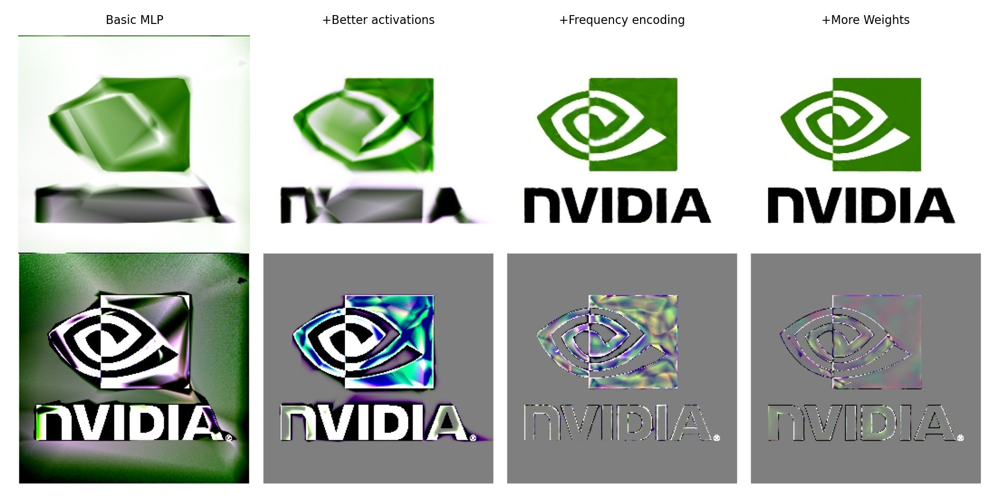

# RTX Neural Shading: SlangPy Training Example

## Purpose

This sample shows how to create and train network architectures in Python using the SlangPy library. This lets you experiment with different networks, encodings and more, but without needing to change or rebuild C++ code.

As a demonstration, this sample instantiates multiple different network architectures and trains them side-by-side on the same data. It also shows one possible approach of exporting the final network parameters and architecture to disk so it can be loaded from C++ without needing to edit header files.

We revisit the texture training example from [Simple Training](SimpleTraining.md) and show how small tweaks to the network architecture can have a big impact on training quality. How to build a good model for a particular application is far outside the scope of this document, and this is intended as an illustrative example and should not be considered practical texture compression.



## Motivation

It's almost impossible to know ahead of time which kind of network will perform best for a given application. The development process of a neural model usually involves an exploration phase, where many different architectures and training setups are tried.

We used a predetermined network architecture in each of the previous samples for simplicity, and this can work well if you already know the network is a good match to your problem. However, when that's not the case, doing model exploration in the previous samples can be inconvenient, as it requires changes to multiple files and recompilation each time.

Popular machine learning frameworks such as `pytorch` or `jax` are designed to make this kind of exploration easy. Unfortunately however, these frameworks are geared more towards large networks, and using them for the small networks we explore here entails a large performance penalty compared to training with RTXNS. We'll show an alternative approach that uses the building blocks of RTXNS, but applies them in a modular way in Python similar to `pytorch`.

## Setup steps

To run the sample, some additional dependencies are required.

#### Prerequisites

A recent version of Python (`Python >= 3.9`) is required. Installation instructions vary by platform.

#### Installation

In the root folder, running the command
```
pip install -r samples/SlangpyTraining/requirements.txt
```
will install the necessary requirements.

### Running the sample

In the root folder, the following command
```
python samples\SlangpyTraining\SlangpyTraining.py
```
will launch the SlangPy sample. This will pop up a window that trains four different network architectures, one after the other. The model fit is displayed at the top, and an amplified error image between the reference and the fit is shown at the bottom.

After training completes, the best model is written to disk, and the sample compiles an inferencing shader for the model that was just trained. It then launches a C++ sample program that will evaluate the model, similar to the [Simple Training](SimpleTraining.md) sample.

## SlangPy Overview

This sample uses the SlangPy library, which provides an easy way to call GPU code written in Slang from Python. A full explanation of SlangPy is out of scope for this document, and the [official documentation](https://SlangPy.readthedocs.io/en/latest/) is a good place for exploring more in-depth, but we will briefly go over the basics.

### Device setup

The first step is to create a `Device()` object. To help set up the include paths used in the sample, the `SDKSample` class from `Helpers.py` will do this automatically when it is instantiated:
```
sample = SDKSample(sys.argv[1:])
device = sample.device
```

From there, the next step is to load a slang module:
```
module = Module.load_from_file(device, "SlangpyTraining.slang")
```

This returns a `Module` that contains all the types and functions from the slang module.

### Simple function calls

Let's say it contained this function:
```
float add(float a, float b)
{
    return a + b;
}
```
then we could call it from Python like so:
```
result = module.add(1.0, 2.0)
print(result) # 3.0

# Named parameters are also supported
result = module.add(a=1.0, b=2.0)
```
Internally, this generates a compute shader and runs it on the GPU to compute the result.

Doing this for two numbers is not particularly efficient. However, SlangPy provides an easy way to apply the same function to a large number of elements. If we change the code to instead pass a large array of floats:
```
a = np.random.rand(1000000)
b = np.random.rand(1000000)

result = module.add(a, b, _result=np.ndarray)

print(result[:10])
```
then we run the same function as before, but now applied individually to each of the 1'000'000 elements.

Applying a function equally over a large group of data is core to graphics programming, and the goal of SlangPy is to make this easy. SlangPy accepts a variety of different types as arguments, including NumPy arrays, textures and torch.Tensors.

SlangPy comes with a handful of builtin types to make working with calls easier. The default return type of a SlangPy call is `NDBuffer`, which is a GPU buffer with a given shape and (Slang) element type. It's possible to request alternate output formats, e.g. in the form of a NumPy array, by passing a type to the `_result` argument like in the example above.

### Passing structs

Slang structs can be passed as a Python dictionary. For example, the following slang function:
```
struct Color { float red; float green; float blue; }
void processColor(Color c) { /* ... */ }
```
can be called from Python like this:
```
module.processColor({"red": 1.0, "green": 0.5, "blue": 0.0})
```
Equivalently, we can create a matching Python class and provide a `get_this` method:
```
class Color:
    # ...

    def get_this(self):
        return {"red": self.red, "green": self.green, "blue": self.blue}

c = Color( .... )
module.processColor(c)
```
When encountering a Python object with a `get_this` method, SlangPy will call it to unpack the object and then translate it to slang. The name of the Python class is not important; just that the dictionary fields match the Slang struct.

## Architecture overview

In order to try out different networks, we need a way to run the building blocks of the RTXNS slang library without manually writing the training and inferencing code.

The main idea is very similar to how frameworks like `pytorch` work. First, we take the components of RTXNS and make them conform to a shared interface (in torch, this would be `torch.nn.Module`) with a differentiable `forward` method. Then, we provide ways to combine and mix those modules together to build powerful architectures (the equivalent of `torch.nn.Sequential`).

To achieve this, this sample adds a small wrapper around RTXNS in `NeuralModules.slang`. First, it introduces a new interface:
```
interface IModule<T : __BuiltinFloatingPointType, let NumInputs : int, let NumOutputs : int>
{
    [BackwardDifferentiable]
    CoopVec<T, NumOutputs> forward(CoopVec<T, NumInputs> inputParams);
}
```
A type that conforms to `IModule<T, NumIn, NumOut>` will provide a `forward` method that takes a CoopVector with `NumIn` elements of type `T`, does some computation, and returns a CoopVector with `NumOut` elements.

This way, we can write generic code that can work with any model, without actually needing to know what the model is. For example, `SlangpyTraining.slang` defines this function:
```
[Differentiable]
float3 EvalModel<Model: rtxns::IModule<half, 2, 3>>(Model model, no_diff float2 inputUV)
{
    var inputVec = rtxns::CoopVecFromVector<half>(inputUV);

    var result = model.forward(inputVec);

    return rtxns::VectorFromCoopVec(result);
}
```
to evaluate a model. From the interface constraint `Model: rtxns::IModule<half, 2, 3>`, we know the model takes 2 inputs and produces 3 outputs (UV coordinates and RGB in this sample), and it will correctly evaluate any model that conforms to this requirement. Both `IModule::forward` and `EvalModel` are marked as differentiable, meaning we can backpropagate through the model just by calling `bwd_diff(EvalModel)`.

This lets us write a completely generic training function that will compute the gradients for a model that should fit a reference texture:
```
void TrainTexture<
    Model : rtxns::IModule<half, 2, 3>,
    Loss : rtxns::mlp::ILoss<float, 3>
>(Model model, inout RNG rng, Texture2D<float4> targetTex, float lossScale)
{
    // Get a random uv coordinate for the input
    float2 inputUV = clamp(float2(rng.next(), rng.next()), 0.0, 1.0);

    // Sample the target texture at the generated UV
    float3 targetRGB = SampleTexture(targetTex, inputUV).rgb;

    // Evaluate the current output of the model
    float3 predictedRGB = EvalModel(model, inputUV);

    // Evaluate the loss gradient
    float3 lossGradient = Loss.deriv(targetRGB, predictedRGB, lossScale);

    // Backpropragate gradient through network parameters
    bwd_diff(EvalModel)(model, inputUV, lossGradient);
}
```
This function follows the same pattern as the [Simple Training](SimpleTraining.md) example, except that the model itself is now abstracted into a generic parameter. It goes through the following steps:
- Generate a random UV coordinate
- Evaluate the reference RGB color `targetRGB` by sampling the target texture
- Evaluate the model at the same coordinate with `EvalModel` to get the `predictedRGB` color
- Compute the gradient of the loss comparing them with `Loss.deriv(targetRGB, predictedRGB, lossScale);`
- Backpropagate the gradient with `bwd_diff(EvalModel)`.

Compared to the previous sample, this condenses the function quite a bit, and it is now reusable: We can pass in any model that takes 2 inputs and produces 3 outputs, and we can rely on slang to generate the correct inference and gradient code.

### Neural Model implementations

What do these `IModule` implementations actually look like? For the most part, these are just thin wrappers around RDXNS functions. For example, `NeuralModules.slang` contains a `FrequencyEncoding` that looks like this:
```
struct FrequencyEncoding<
    T : __BuiltinFloatingPointType,
    let NumInputs : int,
    let NumScales : int
> : IModule<T, NumInputs, NumScales * NumInputs * 2>
{
    [BackwardDifferentiable]
    CoopVec<T, NumScales * NumInputs * 2> forward(CoopVec<T, NumInputs> inputParams)
    {
        return rtxns::EncodeFrequencyN<T, NumInputs, NumScales>(inputParams);
    }
}
```
In its `forward` method, this calls directly to the `rtxns::EncodeFrequencyN` function. The important piece is providing the appropriate generic arguments to `IModule`, so that any code using `FrequencyEncoding` now knows about the number of inputs and outputs. We can rely on Slang AutoDiff to generate the correct gradients.

We will explain the other implementations in more detail at the end of this document, but most importantly we have a `TrainableMLPModule` that has the same parameters as the `TrainingMLP`, with the addition of activations, and a `ModuleChain` that chains multiple modules together, and feeds the output of one to the next.

### Neural Modules in python

`NeuralModules.slang` now lets us write arbitrary network architectures without writing any code. Instead, we can declare the whole network as a single type by combining the classes above.

However, writing networks this way gets _very_ verbose. For example, reproducing the network from the [Simple Training](SimpleTraining.md) sample becomes this:
```
rtxns::ModuleChain<half, 2, 12, 3,
    rtxns::FrequencyEncoding<half, 2, 3>,
    rtxns::InferenceMLPModule<half, 4, 12, 32, 3,
        rtxns::mlp::LeakyReLUAct<half, 32>,
        rtxns::mlp::SigmoidAct<half, 3>
    >
>
```
This gets a bit tedious. However, we don't have to declare this type by hand - Python can do this for us.

`NeuralModules.py` defines many of the same types as `NeuralModules.slang`, with `CoopVecModule` as the root type. The name was chosen deliberately to avoid confusion with the SlangPy `Module` or the pytorch `Module`. It defines a few useful abstract functions:
- `@property type_name`: Returns a string corresponding to the slang type this module represents
- `get_this()`: Returns a dictionary with the module fields. This way, a `CoopVecModule` instance can be passed directly to Python
- `parameters()`, `gradients()`: A list of parameter buffers and their gradients that will be used/produced in forward/backward, respectively

With the Python modules, we can start building network architectures like the one above:
```
encoding = FrequencyEncoding(DataType.float16, 2, 3)
mlp_with_encoding = ModuleChain(
    encoding,
    TrainableMLP(device, DataType.float16,
                    num_hidden_layers=3,
                    input_width=encoding.fan_out,
                    hidden_width=32,
                    output_width=3,
                    hidden_act=LeakyReLUAct(),
                    output_act=SigmoidAct())
)
```
This does a few things: Instantiating `TrainableMLP` creates the CoopVector buffers to store the weight/bias parameters and gradients. These can be found via `mlp_with_encoding.parameters()` and `.gradients()`, respectively. Second, we now have the type name of the model. Third, thanks to `get_this()`, we can pass `mlp_with_encoding` directly to slang functions expecting an `IModule`.

For example, calling `EvalModel` can be done with
```
module[f"EvalModel<{mlp_with_encoding.type_name}>"](mlp_with_encoding, ....)
```
Because `EvalModel` is generic, we need to specialize it with the generic arguments first before we can call it with SlangPy. We can do this by building the function name as a string and looking it up in the Slang module with `[]`.

The model architecture and its parameters are now all defined in one place: We just need to change how we construct `mlp_with_encoding`, and all the slang code needed to train it will automatically work with it. We can pass the Python object `mlp_with_encoding` directly and can rely on all the correct buffers being passed, even when we change the network architecture.

And all this without recompiling!

## Python overview

Now that we have an overview of how the sample works, let's look at how the sample actually runs. It process in the following steps:

### Hyperparameters

After device setup, we define some hyperparameters for training such as the learning rate, size of each batch, etc. These values are a good starting point, but like any aspect of a network, can be tuned:
```
    batch_shape = (256, 256)
    learning_rate = 0.005
    grad_scale = 128.0
    loss_scale = grad_scale / math.prod(batch_shape)

    sample_target = 1000000000
    num_batches_per_epoch = 1000 if INTERACTIVE else 5000
    num_epochs = sample_target // (num_batches_per_epoch * math.prod(batch_shape))
```

### Model setup

Next, we set up four different network architectures. The simplest one is a single MLP, which we can create by instantiating a `TrainableMLP`:
```
basic_mlp = TrainableMLP(device, DataType.float16,
                         num_hidden_layers=3,
                         input_width=2,
                         hidden_width=32,
                         output_width=3,
                         hidden_act=ReLUAct(),
                         output_act=NoneAct())
```
The arguments match those of the `TrainingMLP` from `MLP.slang`. Internally, this will create a buffer to hold the CoopVector weights and sets the network weights to a random initialization.

We can create more interesting architectures by chaining multiple modules together. This lets us create a network with an input encoding, for example:
```
encoding = FrequencyEncoding(DataType.float16, 2, 3)
mlp_with_encoding = ModuleChain(
    encoding,
    TrainableMLP(device, DataType.float16,
                 num_hidden_layers=3,
                 input_width=encoding.fan_out,
                 hidden_width=32,
                 output_width=3,
                 hidden_act=LeakyReLUAct(),
                 output_act=SigmoidAct())
)
```
`ModuleChain` takes a list of modules as input.

### Setting up data generation

We will generate the training data for our network by randomly sampling the reference texture. To set this up, we first need to load the texture we want to fit:
```
target_tex = sample.load_texture("nvidia-logo.png")
```

Next, we need to set up a random number generator. There is a simple generator implemented in `SlangpyTraining.slang`:
```
struct RNG
{
    uint state;

    __init(uint state) { this.state = state; }
    /* ... */
}
```
We want to pass a separate `RNG` instance for each thread in the batch. To do this, we first load the module containing `RNG`:
```
module = Module.load_from_file(device, "SlangpyTraining.slang")
```
Next, we create a random initial seed for each batch entry. We can do this with NumPy:
```
pcg = np.random.PCG64(seed=12345)
seeds = pcg.random_raw(batch_shape).astype(np.uint32)
```
This gives us an `ndarray` of shape `batch_shape`, filled with random integers. Finally, we run the slang constructor of `RNG` with this call:
```
rng = module.RNG(seeds)
```
The slang constructor takes a single `uint`, but because we pass an array of `uint`s, the constructor is vectorized and called once for each entry in `seeds`. The output value will be an `NDBuffer` of `RNG` instances, of shape `batch_shape`.

### Setting up training

Before we can set up training, we need to do a few things.

First, we need to setup the optimizer. This needs the same amount of state as the [Simple Training](SimpleTraining.md) sample, but as a refresher, this is the signature of the optimizer function in `SlangpyTraining.slang` we intend to call later:
```
void OptimizerStep(
    RWBuffer<float> moments1,
    RWBuffer<float> moments2,
    RWBuffer<float> paramF,
    RWBuffer<half> paramH,
    RWBuffer<half> grad,
    uint idx,
    float learningRate,
    float gradScale,
    int iteration)
```
`paramH` and `grad` are the half precision parameters and derivatives of our model, which we can get from the model directly:
```
grads = model.gradients()[0]
parameters = model.parameters()[0]
```
For simplicity, the sample assumes there is only one buffer of parameters in the model, and supporting multiple is left as an exercise.

Next, we need to convert the half precision parameters to full precision so we don't accrue rounding errors during training. In previous samples, this required setting up an extra compute shader. With SlangPy, there's a much easier way: In `SlangpyTraining.slang`, we defined the function
```
float ConvertToFloat(half paramH)
{
    return (float)paramH;
}
```
and we can call it with
```
parametersF = module.ConvertToFloat(parameters)
```
It is applied to each `half` element in `parameters`, and returns a buffer of the same shape, but of type `float`. Nice!

We also need to create two buffers for the optimizer moments and initialize them to zero. `NDBuffer` has a static `zeros_like` function for this that creates a zero-initialized `NDBuffer` with the same shape and dtype as an existing buffer. With this, we can set up the optimizer state:
```
optimizer_state = {
    "moments1": NDBuffer.zeros_like(parametersF),
    "moments2": NDBuffer.zeros_like(parametersF),
    "paramF": parametersF,
    "paramH": parameters,
    "grad": grads,
    "learningRate": learning_rate,
    "gradScale": grad_scale
}
```
You'll notice that the keys of this dictionary match up with the parameter names of the `OptimizerStep` function above. Python allows unpacking a dictionary into named parameters, and SlangPy supports this as well. This means we can call the optimizer with `OptimizerStep(**optimizer_state)`, which is a lot more convenient---of course, we still have to supply the remaining parameters of `idx` and `iteration`.

Next, we fetch the Slang functions from `SlangpyTraining.slang` we intend to call in the training loop. These are the functions we need:
```
OptimizerStep /* ... */
TrainTexture<Model : rtxns::IModule<half, 2, 3>, Loss : rtxns::mlp::ILoss<float, 3>> /* ... */
EvalModel<Model: rtxns::IModule<half, 2, 3>> /* ... */
EvalLoss<Loss : rtxns::mlp::ILoss<float, 3>> /* ... */
```
`OptimizerStep` is not a generic function, and we can get it directly:
```
optimizer_step = module.OptimizerStep
```
However, the other three take the model type or the loss type as generic parameters, and we need to specialize them (i.e. plug in our generic arguments) first. The easiest way to do this is to build the name of the specialized function with string formatting:
```
train_texture = module[f"TrainTexture<{model.type_name}, {loss_name} >"]
eval_model = module[f"EvalModel<{model.type_name} >"]
eval_loss = module[f"EvalLoss<{loss_name} >"]
```

### Main training loop

The objective of the training loop is to alternately call `train_texture` and `optimizer_step` many times until the model has converged. The simplest form look like this:
```
iteration = 0
for batch in range(num_batches):
    train_texture(model, rng, target_tex, loss_scale)
    optimizer_step(idx=call_id((num_params, )), iteration=iteration, **optimizer_state)
    iteration += 1
```
The only new thing here is the `call_id(call_shape)` function. This supplies the index of the thread within the vectorized call, which we use here to index into the buffers.

When doing many calls in a tight loop, it can be faster to append them to a command buffer first and dispatch them all at once. This can be done with `append_to`:
```
cmd = device.create_command_buffer()
cmd.open()
for batch in range(num_batches_per_epoch):
    train_texture.append_to(cmd, model, rng, target_tex, loss_scale)
    optimizer_step.append_to(cmd, idx=call_id((num_params, )), iteration=iteration, **optimizer_state)
    iteration += 1
cmd.close()
device.submit_command_buffer(cmd)
```
`SlangpyTraining.py` makes one more modification, and breaks training up into _epochs_. Between each epoch, we update the screen and print out some helpful info.

### After training

After training is complete, the parameters of the model are stored to disk in JSON format. The `CoopVecModule` base class has a `serialize()` method for this:
```
param_dict = best_model.serialize()
open(weight_path, "w").write(json.dumps(param_dict, indent=4))
```

The weights alone would not be helpful. We also need a way to save the architecture of the model to disk somehow so we can do inference on it later. The architecture is fully encoded in the type, so we could simply store the network's `type_name`.

However, there are two complications: First, we don't want to use the `TrainingMLP` for inference. Second, besides the weights, we also need a way to initialize the constants in the model. These include simple scalars like the negative slope of a `LeakyReLUAct`, but could also include more challenging fields like the parameter buffer or the CoopVec matrix/bias offsets for an `MLP`. These needs to be supplied at runtime and can't be stored to disk directly.

The approach that the sample chooses is deliberately simple. `CoopVecModule` has an `inference_type_name` property, which returns the type that should be used for inference. This is usually the same as for training, except for the MLP, which returns `InferenceMLP` instead. The module also defines a `get_initializer()` method, which returns a braced initializer string meant to be run as slang code.

To understand what this does, let's see how it is used. The sample ultimately compiles an inference shader with the network architecture baked in, and then runs the C++ sample that loads the model and does inference on it:
```
sample.compile_inference_shader(best_model)
sample.run_sdk_inference(weight_path)
```
The shader in question is `SlangpyInference.slang`, which contains this function for setting up the model:
```
float3 evalModel(StructuredBuffer<half> weights, uint wo[MAX_LAYER_COUNT], uint bo[MAX_LAYER_COUNT], float2 uv)
{
    // Auto-generated defines from SlangpyTraining.py
    MODEL_TYPE model = MODEL_INITIALIZER;

    /* ... */
}
```
`SlangpyTraining.py` sets the defines `MODEL_TYPE` and `MODEL_INITIALIZER` to the type name and initializer list of the model that was trained. Expanding these defines for one of the architectures trained by the samples gives this:
```
float3 evalModel(StructuredBuffer<half> weights, uint wo[MAX_LAYER_COUNT], uint bo[MAX_LAYER_COUNT], float2 uv)
{
    // Auto-generated defines from SlangpyTraining.py
    ModuleChain<half, 2, 12, 3,
        FrequencyEncoding<half, 2, 3>,
        InferenceMLPModule<half, 4, 12, 32, 3,
            rtxns::mlp::LeakyReLUAct<half, 32>,
            rtxns::mlp::SigmoidAct<half, 3>
        >
    > model = {
        {},
        {
            weights,
            { wo[0], wo[1], wo[2], wo[3], wo[4] },
            { bo[0], bo[1], bo[2], bo[3], bo[4] },
            { 0.01h },
            {}
        }
    }

    /* ... */
}
```
This initializes the constants (such as the negative slope) as well as the parameter buffer and offsets that are passed in by the runtime.

This approach was chosen for simplicity, but it is far from robust. For example, it assumes there are variables such as `weights` and `wo` in the surrounding scope, and would not work if there were multiple MLPs in the model. More advanced solutions are left as an exercise.

## Appendix: NeuralModule details

A more complex example of an `IModule` implementation is the `TrainableMLPModule`. Breaking it down, it begins with:
```
struct TrainableMLPModule<
    T : __BuiltinFloatingPointType,
    let NumHiddenLayers : int,
    let InputNeurons : int,
    let HiddenNeurons : int,
    let OutputNeurons : int,
    let ComponentType : CoopVecComponentType,
    HiddenAct : mlp::IActivation<T, HiddenNeurons>,
    OutputAct : mlp::IActivation<T, OutputNeurons>
> : IModule<T, InputNeurons, OutputNeurons>
/* ... */
```
This takes the same generic parameters as the `TrainingMLP` used in the [Shader Training](ShaderTraining.md) sample, with the addition of the hidden and output activations. 

Internally, the module stores all the information needed to create and evaluate a `TrainingMLP`:
```
/* ... */
    ByteAddressBuffer parameters;
    RWByteAddressBuffer derivatives; 
    uint matrixOffsets[NumHiddenLayers + 1];
    uint biasOffsets[NumHiddenLayers + 1];

    HiddenAct hiddenAct;
    OutputAct outputAct;
/* ... */
```

The forward method then does exactly that:
```
/* ... */
[BackwardDerivative(backward)]
CoopVec<T, OutputNeurons> forward(CoopVec<T, InputNeurons> inputParams)
{
    var mlp = mlp::TrainingMLP<
        T, 
        NumHiddenLayers, 
        InputNeurons, 
        HiddenNeurons, 
        OutputNeurons, 
        CoopVecMatrixLayout::TrainingOptimal, 
        ComponentType
    >(parameters, derivatives, matrixOffsets, biasOffsets);
    return mlp.forward(inputParams, hiddenAct, outputAct);
}
/* ... */
```
We can now use the `TrainingMLP` in any function that takes an `IModule`.

#### Chaining modules

The last piece to make `IModule` useful is a way to chain multiple modules together, so that the outputs of one feed into the next.

This is achieved by the `ModuleChain` type:
```
struct ModuleChain<
    T : __BuiltinFloatingPointType,
    let NumInputs : int,
    let NumHidden : int,
    let NumOutputs : int,
    First : IModule<T, NumInputs, NumHidden>,
    Second : IModule<T, NumHidden, NumOutputs>
> : IModule<T, NumInputs, NumOutputs>
```
It takes two other modules, `First` and `Second`. The generic constraint here guarantees that `Second` takes as many outputs as `First` produces.

The rest of the implementation then is easy. `ModuleChain` stores the two modules, and the `forward` method calls the first and feeds forward the output to the second:
```
{
    First first;
    Second second;

    [BackwardDifferentiable]
    CoopVec<T, NumOutputs> forward(CoopVec<T, NumInputs> inputParams)
    {
        CoopVec<T, NumHidden> middle = first.forward(inputParams);
        return second.forward(middle);
    }
}
```
This only handles two modules chained together, but that is enough. To get anything more, we can nest this type. E.g. if we want to combine modules `A`, `B` and `C`, we can first chain `A` and `B` together, and then combine the resulting `ModuleChain` with `C`.